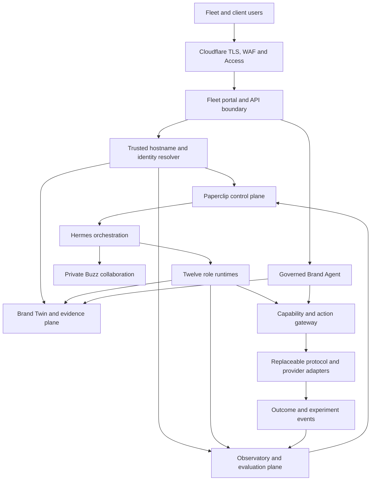

# Fleet unified platform enterprise implementation plan

- **Status:** approved direction; implementation-ready programme
- **Business:** Fleet
- **Current internal Paperclip company:** Fleet DMA
- **Client portal domain:** `madebyfleet.com`
- **Platform:** Agency OS, powered by Hermes, Paperclip and Buzz
- **Delivery posture:** additive evolution of the verified live system

## 1. Executive decision

Fleet will build one unified Agency OS platform with independently selectable
product modules. Automated Content Production remains a first-class product. It
will be joined by the Brand Operating System capabilities rather than replaced.

The platform will use these operating rules:

1. Fleet is the client-facing business.
2. Agency OS is the internal platform and repository name.
3. Fleet DMA remains Fleet's internal Paperclip company and the first live
   "dogfood" tenant.
4. Each future client brand receives its own `brand_id` and isolated Paperclip
   company inside the same Agency OS deployment.
5. A Paperclip company represents a business tenant, not a Fleet product.
6. Product modules are enabled through versioned entitlements and Paperclip
   programme templates; separate product companies are not created.
7. Client users will eventually work through
   `<brand-slug>.madebyfleet.com`. Paperclip itself remains private.
8. Existing content workflows remain available and verified throughout the
   programme.

This structure creates one continuous improvement loop:

> understand the brand, observe the market, find a gap, produce the right
> content or capability, approve it, deploy it, retest it, measure the result
> and retain only evidence-backed learning.

## 2. Intended business outcome

Fleet should be able to sell a client any of the following without deploying a
different platform:

1. **Fleet Content Engine** — automated research, production, optimisation,
   creative, QA, approval, publication, social adaptation and measurement.
2. **Fleet Content Intelligence** — the Content Engine plus the Brand Twin,
   claims and evidence, competitor intelligence and AI-discovery gap analysis.
3. **Fleet AI Brand Readiness** — the Brand Twin, AI Market Observatory,
   machine-readable brand information and an evidence-backed remediation plan.
4. **Fleet Brand OS** — the complete system, including content, intelligence,
   a governed Brand Agent, controlled customer actions, experimentation and
   continuous improvement.
5. **Fleet Agentic Commerce** — a later optional extension for eligible retail
   or transactional clients after the underlying system is proven.

Clients can begin with automated content production and adopt other modules
without migration, re-onboarding or duplication of their brand data.

## 3. Programme outcomes

The first enterprise programme must:

- preserve the currently verified Core and Social content workflows;
- establish Fleet DMA as Fleet's internal tenant and template authority;
- introduce a versioned, evidence-backed Living Brand Twin;
- introduce an AI Market Observatory based on repeatable customer missions;
- convert approved Observatory findings into Paperclip-authoritative work;
- use the existing Content Engine to resolve selected findings;
- retest the same missions and report before-and-after evidence;
- deploy a read-only Brand Agent grounded in the approved Brand Twin;
- add one controlled, reversible action requiring explicit confirmation;
- define product entitlements that can be enabled per client;
- establish the secure portal foundation for
  `<brand-slug>.madebyfleet.com`;
- onboard the first real client into a separate Paperclip company only after
  Fleet has completed the internal pilot; and
- make commerce a later, evidence-driven decision rather than a prerequisite.

## 4. Scope boundaries

### 4.1 Included

- additive schemas, stores and APIs for the Brand Twin and Observatory;
- Paperclip programme, issue and approval templates;
- a Fleet tenant registry and product entitlement model;
- repeated, evidence-retaining AI-market observations through permitted
  interfaces;
- content-gap and capability-gap findings;
- the closed loop from finding to content remediation to retest;
- a portable Brand Agent interface;
- MCP-based read capabilities and one approved action capability;
- client-scoped portal APIs and a private-beta portal;
- client isolation, authentication, authorisation, audit and evaluation;
- versioned evolution of the 12 existing runtime roles;
- model- and provider-neutral adapters; and
- operating and acceptance documentation.

### 4.2 Explicitly deferred

- automatic advertising-budget control;
- unreviewed public publishing;
- unbounded agent autonomy;
- mass onboarding or self-service subscription billing;
- full ecommerce and payment implementation;
- a large marketplace of provider integrations;
- client-owned vanity domains;
- the complete public Fleet marketing website;
- a highly polished portal before the product loop is proven;
- replacing Paperclip, Hermes or Buzz;
- creating more agents merely to mirror an organisation chart; and
- treating synthetic consumers as proof of real customer behaviour.

### 4.3 Externally owned infrastructure

VM backup and disaster recovery remain under the direct control of the human VM
owner. They are outside the Agency OS completion gate and will not block this
programme. Application-level data integrity, export, audit and safe failure
remain in scope.

## 5. Naming, tenancy and identity

| Concept | Canonical meaning |
|---|---|
| Fleet | The business that sells and operates the service |
| Agency OS | The shared technology platform |
| Fleet DMA | Fleet's internal Paperclip company |
| Client Paperclip company | The authoritative work boundary for one client brand |
| `brand_id` | The immutable Agency OS tenant identifier for one client brand |
| `company_id` | The Paperclip identifier bound to exactly one `brand_id` |
| `brand_slug` | The reviewed portal label used in a Fleet-owned hostname |
| Product entitlement | A versioned grant enabling one Fleet product module |
| Fleet operator | An authorised Fleet employee or runtime role |
| Client user | A person permitted to access one or more roles within one client tenant |

### 5.1 Tenant rules

- One `brand_id` binds to exactly one active Paperclip `company_id`.
- A `company_id` cannot be rebound to another brand.
- A portal hostname resolves server-side to one active `brand_id`.
- The browser cannot select or override `brand_id`, `company_id` or role.
- Every business record includes `brand_id`.
- Every read, write, search, export, evaluation and model context is
  brand-scoped.
- Cross-brand portfolio data may contain only approved aggregates and never raw
  client content or prompts.
- Fleet DMA may contain Fleet's own brand information, platform templates and
  internal programme work. It must not become a shared bucket for client data.
- The deleted fictional Paperclip company will not be recreated as a product
  workspace. Tests continue to use fixtures and isolated state.

### 5.2 Client-company provisioning

When Fleet signs a client, an authorised onboarding workflow will:

1. issue an immutable `brand_id`;
2. create or admit one Paperclip company;
3. bind the company and brand IDs;
4. reserve and approve a unique `brand_slug`;
5. select product entitlements;
6. install programme and issue templates;
7. create the brand's approver policy;
8. configure client and Fleet access;
9. create the initial Brand Twin source register;
10. run tenant-isolation acceptance checks; and
11. activate the tenant only after independent assurance passes.

## 6. Unified product modules

### 6.1 Module A — Fleet Content Engine

The current workflow remains a permanent product module:

1. intake and brand context;
2. research and strategy;
3. drafting;
4. answer and search optimisation;
5. visual production;
6. editorial and claims QA;
7. exact approval;
8. publication or provider handoff;
9. social adaptation when enabled;
10. measurement; and
11. evidence-backed learning.

The existing schemas and checksummed asset lifecycle remain authoritative.
Brand Twin facts and claims become additional approved inputs; they do not
weaken QA, approval or publication gates.

### 6.2 Module B — Living Brand Twin

The Brand Twin is the governed representation of what a brand is, offers, may
say and can do. It covers:

- brand and legal identity;
- products and services;
- audiences, needs and customer missions;
- approved facts and terminology;
- claims, limitations and supporting evidence;
- offers, prices, eligibility and availability where applicable;
- policies, guarantees and service conditions;
- locations, channels and authorised partners;
- competitors and declared comparison rules;
- brand voice and prohibited language;
- machine-readable capabilities;
- source ownership, freshness and expiry;
- contradictions and unresolved questions; and
- complete version and approval history.

The first implementation uses a clear relational/document model. A specialised
graph database is added only when measured query or scale needs justify it.

### 6.3 Module C — AI Market Observatory

The Observatory evaluates how external AI and search systems understand and
represent a brand. It uses a versioned registry of real customer missions. Each
mission includes:

- the customer need and context;
- jurisdiction and language;
- target outcome;
- allowed prompt variants;
- eligible test platforms;
- expected facts and unacceptable errors;
- relevant competitors;
- commercial value band;
- observation trigger policy; and
- a human owner.

Each observation records the platform, model or experience when available,
time, exact mission and prompt variant, repeat number, sources, brand mention,
recommendation, factual accuracy, comparison outcome, action completion,
latency, evaluator version, evidence and checksum.

The Observatory reports distributions, confidence and limitations. It does not
claim a single permanent "AI ranking."

### 6.4 Module D — Brand Agent

The Brand Agent is the client's governed conversational representative. Its
first release will:

- read only approved, active Brand Twin records;
- answer supported questions and cite evidence;
- state uncertainty and refuse unsupported claims;
- compare products only within approved rules;
- collect no unnecessary personal data;
- expose a portable read interface through versioned MCP;
- support a Fleet-owned web experience; and
- pass a client-specific evaluation suite before activation.

Later adapters may support ChatGPT Apps, NLWeb, other approved assistants,
voice and messaging.

### 6.5 Module E — Capability and action gateway

Brand capabilities are defined once and exposed through replaceable protocol
adapters. Examples include `find_product`, `compare_products`,
`check_availability`, `create_quote`, `book_appointment`, `request_sample`,
`find_location`, `track_order`, `start_return` and `open_support_case`.

The first write capability must be reversible and low consequence, such as a
test enquiry or human callback request. It requires authenticated context,
exact tenant, an active capability grant, validated arguments, explicit
confirmation, exact destination and operation, idempotency, an action receipt
and visible reconciliation of uncertain outcomes.

Payments and autonomous purchases are not part of the first action release.

### 6.6 Module F — Measurement and experimentation

The system distinguishes:

- output: what Fleet produced;
- observation: how a platform represented the brand;
- behaviour: what a person or agent did;
- conversion: the recorded business result; and
- incrementality: what evidence supports as caused by the intervention.

Synthetic agents may support exploratory testing and evaluation. They may not
be represented as real consumer research. Material commercial decisions require
real behaviour, controlled experiments or calibrated causal analysis.

### 6.7 Module G — Fleet client portal

The portal is a client experience over approved Agency OS and Paperclip state,
not an alternative workflow database. It will eventually provide:

- executive summary and priorities;
- programmes, work and approvals;
- Brand Twin, claims and evidence;
- Observatory findings and before/after evidence;
- content opportunities, production and performance;
- Brand Agent conversations, evaluations and capabilities;
- experiments and commercial outcomes;
- users, roles and client-safe exports.

## 7. Fleet improvement flywheel

```mermaid
flowchart LR
    A["Approved Brand Twin"] --> B["Customer missions"]
    B --> C["AI Market Observatory"]
    C --> D["Evidence-backed finding"]
    D --> E["Paperclip work and approval"]
    E --> F["Content or capability production"]
    F --> G["QA and exact approval"]
    G --> H["Controlled deployment"]
    H --> I["Repeat original missions"]
    I --> J["Experiment and measurement"]
    J --> K["Validated learning"]
    K --> A
```



The first integrated proof must complete this loop for at least one Fleet
mission and one content remediation.

## 8. Target architecture



### 8.1 Authority boundaries

| Concern | Authority |
|---|---|
| tasks, dependencies, budgets, approvals and closure | Paperclip |
| executive orchestration | Hermes |
| collaboration | Buzz, non-authoritative |
| tenant and company binding | protected Agency OS tenant registry |
| approved brand truth | Brand Twin with Paperclip approval evidence |
| content lifecycle | existing checksummed Agency OS contracts |
| external writes | capability and action gateway |
| portal display | replaceable read model from authoritative state |
| portal mutations | commands routed to Paperclip or action gateway |
| AI observations | immutable Observatory evidence |
| validated learning | existing Director-governed lifecycle |

### 8.2 Architectural rules

- Portal code never accesses the Paperclip database directly.
- External AI responses never become approved Brand Twin truth automatically.
- Retrieved content is untrusted input and cannot grant capabilities.
- Model output cannot approve its own work.
- Protocols use versioned adapters and conformance tests.
- Long work uses durable identifiers and explicit state.
- A model change cannot enter production until evaluations pass.
- Presentation models may be rebuilt; authoritative records remain in their
  owning systems.

## 9. Core data contracts

| Record | Purpose |
|---|---|
| `BrandTenant` | Immutable brand, Paperclip company and hostname binding |
| `ProductEntitlement` | Modules, limits, version and effective period |
| `BrandSource` | Source, owner, trust class, access and refresh policy |
| `BrandEntity` | Versioned brand, product, service, location, person or partner |
| `BrandClaim` | Exact claim, status, jurisdiction, limitations and evidence needs |
| `ClaimEvidence` | Evidence supporting or challenging a claim |
| `BrandPolicy` | Voice, prohibited language, approvals and restrictions |
| `BrandCapability` | Machine-readable action and permission requirements |
| `CustomerMission` | Versioned objective used for observation and testing |
| `ObservationRun` | Platform, model, mission, variant, time and repeat configuration |
| `Observation` | Evidence and measurements from one test |
| `MarketFinding` | Aggregated, evidence-backed gap, risk or opportunity |
| `RemediationProposal` | Proposed content, data or capability change |
| `Experiment` | Hypothesis, population, intervention and analysis plan |
| `OutcomeEvent` | Brand-scoped behavioural or commercial result |

Every security- or business-relevant record includes `record_id`, `brand_id`,
schema version, status, checksum, provenance, created and effective times,
freshness or expiry, supersession, classification, approval when required and
evidence references.

### 9.1 Claim lifecycle

```text
candidate -> evidence_review -> approved -> active
                                  |             |
                                  v             v
                               rejected      expired/superseded
```

Only active, in-scope claims reach production content or the Brand Agent.
Material evidence changes invalidate downstream approval where policy requires.

### 9.2 Source trust

Sources receive one of these trust classes:

1. client-owned authoritative system;
2. client-approved published source;
3. authoritative external source;
4. reviewed third-party source;
5. unverified discovery source; or
6. prohibited source.

An unverified source may create a review task. It cannot silently change an
approved claim.

## 10. Paperclip operating design

### 10.1 Fleet DMA

Fleet DMA contains Fleet's Brand Twin, platform roadmap, programme templates,
role and evaluation work, Fleet content, Fleet Observatory, first Brand Agent,
product decisions and release approvals. It does not contain raw operating data
for multiple clients.

### 10.2 Standard client-company programmes

| Code | Programme | Purpose |
|---|---|---|
| `00` | Client Onboarding and Governance | identity, access, policy, sources and entitlements |
| `10` | Brand Foundation | Brand Twin, claims, evidence and missions |
| `20` | Content Operations | ongoing Content Engine work |
| `30` | AI Market Presence | observations, findings and remediation |
| `40` | Brand Agent | experience, capabilities and evaluations |
| `50` | Growth Experiments | experiments, outcomes and learning |
| `90` | Assurance and Change | releases, incidents, policy and audits |

Only entitled programmes are activated.

Standard issue types cover source admission, fact review, claim approval,
contradiction resolution, mission design, observation, finding, remediation,
content, capability change, agent evaluation, action approval, experiment,
outcome analysis, learning and assurance.

### 10.3 Finding-to-work boundary

The Observatory may propose a `MarketFinding`; it cannot publish content or
enable a capability. The normal sequence is:

1. store immutable observations;
2. aggregate a finding with confidence and limitations;
3. have the Agency Director admit it into Paperclip;
4. accept, reject or defer remediation under the approved policy;
5. create the exact downstream Paperclip task graph;
6. execute existing role and approval rules;
7. rerun the original missions; and
8. close only when the required evidence exists.

## 11. Role evolution

The 12 roles remain. Contracts are versioned rather than overwritten in place.

| Existing role | Generation 2 responsibility |
|---|---|
| Hermes Agency Director | Portfolio outcomes, modules, mission priority and learning |
| Codex Technical Implementation Specialist | Data, APIs, protocol adapters, portal and capabilities |
| Platform Assurance Reviewer | Independent tenant, security, evaluation and release gate |
| Brand and Brief Steward | Brand Twin, sources, claims, policy and freshness |
| Search and Content Strategist | Missions, market intelligence and remediation strategy |
| Content Producer | Evidence-grounded long-form and interactive content |
| Search and Answer Optimiser | AI discovery, clarity and structured representation |
| Visual and Creative Specialist | Multimodal assets, interaction, rights and provenance |
| Editorial Integrity QA | Factuality, claims, brand integrity and public/private separation |
| Social Amplifier | Community intelligence, earned authority and distribution |
| Publishing Operator | Content, feeds, agent interfaces and destination checks |
| Growth Intelligence Analyst | Observatory, experiments, causal measurement and learning |

No role approves its own consequential output unless a specific bounded brand
policy expressly permits it.

## 12. Client portal and `madebyfleet.com`

### 12.1 Domain plan

Reserve these logical names without exposing unfinished services:

- `www.madebyfleet.com` — future public Fleet website;
- `admin.madebyfleet.com` — Fleet operator experience;
- `<brand-slug>.madebyfleet.com` — client portal;
- `api.madebyfleet.com` — optional authenticated API;
- `status.madebyfleet.com` — later service status; and
- `agents.madebyfleet.com` — optional future agent boundary.

### 12.2 Trusted hostname routing

```text
requested host
  -> normalise and validate
  -> exact active hostname lookup
  -> brand_id and portal policy
  -> authenticated user entitlement
  -> tenant-scoped API context
```

Unknown, disabled or malformed hosts return a neutral response and never fall
back to Fleet DMA. The system looks the hostname up in the protected registry;
it does not trust the subdomain text as a tenant identifier.

### 12.3 Access model

Private beta uses Cloudflare Access plus application authentication. Cloudflare
is an outer gate, not a replacement for tenant and role checks.

Client roles: Client Owner, Approver, Contributor, Analyst and Viewer.

Fleet roles: Platform Administrator, Account Director, Operator, Assurance
Reviewer and Support.

Every request is authorised for resolved hostname, tenant, user, role and
action.

### 12.4 Portal information architecture

The portal includes Home, Brand Twin, Content, AI Presence, Brand Agent,
Experiments, Approvals, Reports and Administration.

Detailed design starts after the closed-loop proof fixes the real data and
actions. The client experience then receives a purpose-built Fleet design
system, responsive layout, WCAG 2.2 AA accessibility, strong information
hierarchy and restrained motion.

### 12.5 Mutation and administration rules

The portal may collect decisions but does not own their authoritative records:
work approval is written to Paperclip; claim approval retains its Paperclip
authority; actions pass through the gateway; accepted mutations return an
authoritative ID; uncertain results remain visibly pending.

Fleet administrators continue using Paperclip privately over Tailscale. The
client portal never exposes Paperclip administration or internal APIs publicly.

## 13. Security, privacy and governance

Required controls include:

- deny-by-default tenant and capability access;
- server-derived identity and tenant context;
- least-privilege role grants;
- exact approval and idempotency for external writes;
- secret isolation from source, prompts, Paperclip and Buzz;
- a model/provider data-handling register;
- source and prompt-injection isolation;
- SSRF protection for ingestion and protocol tools;
- safe rendering of untrusted model and source content;
- CSP, CSRF, session and output-encoding protections;
- rate limits by host, identity and action cost;
- append-only security and action audit;
- explanation for consequential actions;
- data classification and minimisation;
- client offboarding and export; and
- recurring tenant-isolation and agent-red-team tests.

Every admitted model configuration records provider and model, permitted data,
retention and training behaviour where known, task classes, tools and network,
evaluation release, cost and latency limits, fallback, effective date and
expiry. Silent model substitution is forbidden when it would violate policy or
evaluation evidence.

Agent acceptance covers indirect prompt injection, goal hijacking, cross-tenant
retrieval, fabricated citations, tool manipulation, excessive permissions,
replay, hidden content, stale or poisoned sources, compromised protocol
servers, uncertain outcomes and customer manipulation.

Clients can see their sources, approved claims, tested platforms, finding
limits, agent permissions, required human approvals, action history and the
evidence behind improvement claims.

## 14. Evaluation and measurement

An Observatory result is publishable only when mission and evaluator versions
are fixed, the permitted interface is recorded, repeated runs meet the minimum,
failures are reported, platform and prompt variation are retained, evidence is
inspectable, deterministic checks are used where possible, subjective grading
uses rubrics, graders are periodically human-calibrated, and confidence and
limitations accompany conclusions.

Each Brand Agent evaluation set covers correctness, citations, refusal,
jurisdiction and policy, tool arguments, confirmation, tenant isolation, prompt
injection, personal data, brand voice, accessibility, latency and provider
failure.

### 14.1 Closed-loop proof

The first proof demonstrates:

1. an approved Fleet Brand Twin;
2. a repeated mission showing a weakness;
3. an evidence-backed finding;
4. an accepted Paperclip remediation;
5. a content asset completed through the existing workflow;
6. exact QA and approval;
7. controlled deployment or approved preview;
8. a repeat of the same mission set;
9. an honest before-and-after report; and
10. a learning decision stating whether the result is reusable.

A well-evidenced null or negative result is valid and is never rewritten as
success.

### 14.2 Business measures

Track finding-to-remediation completion, blocked dependencies, current evidence
coverage, unresolved contradictions, mission coverage, factual AI
representation, citation and recommendation distributions, action completion,
content rework, approval completion, workflow and mission cost, business
outcomes and experimentally supported incremental value.

## 15. Delivery programme

Delivery is controlled entirely by dependencies and acceptance evidence. The
programme has no calendar estimates, sprint deadlines, weekly milestones or
time-based completion forecasts. Work enters a gate only when its dependencies
are satisfied and leaves only when all exit evidence passes.

Current gate state is read from Paperclip, not copied into this plan.
`PAP-152`, `PAP-153` and `PAP-154` are the G2.0/G2.1 gate records; the protected
appliance verification result is their live runtime evidence. G2.2–G2.8 remain
dependency-linked backlog until those foundation issues are authoritatively
closed after the correction release. No later product completion is claimed.

### Gate G2.0 — preserve and baseline

Record Fleet naming and current company binding without secrets; verify the live
Content Engine; pin workflow, schema and role versions; establish Generation 2
feature flags; approve tenancy, authority and data decisions; create the Fleet
internal pilot and its Paperclip programme.

**Exit:** current verification remains green, content behaviour is unchanged,
Fleet DMA is the internal tenant, no test company is required, and the backlog
is visible in Paperclip.

### Gate G2.1 — unified tenant and product foundation

Implement tenant and hostname bindings, product entitlements, Brand Twin and
Observatory schemas, tenant storage, migrations, Paperclip templates, portal
read models, audit and isolation tests.

**Exit:** modules enable independently, every record is brand-scoped,
cross-tenant access fails closed, content workflows are unchanged, and new
contracts pass compatibility tests.

### Gate G2.2 — Fleet Living Brand Twin

Register Fleet sources; model Fleet identity, services, audiences, claims and
policies; implement trust, freshness, contradiction and evidence-gap checks;
create claim approval; produce Fleet's Brand Operating Profile and approved read
APIs.

Fleet is the first live brand. Unknown information remains unknown. A finished
website is not required for this gate.

**Exit:** every active claim has evidence and an owner; conflicts are resolved
or visible; inactive facts cannot enter production; Paperclip retains approval;
and the Twin can ground Content Engine work.

### Gate G2.3 — AI Market Observatory

Define 50–100 Fleet customer missions and prioritise a launch set; implement
versioned variants, permitted observation adapters, repeated runs, evidence,
evaluators, finding reports and Paperclip integration.

Permitted APIs or approved manual evidence may be used. Prohibited consumer
interfaces are not scraped. Missing credentials reduce coverage visibly.

**Exit:** at least 20 priority missions have repeated evidence; results are
reproducible; reports separate fact, inference and unknown; one content gap is
admitted into Paperclip; no one-off result is called a ranking.

### Gate G2.4 — closed-loop Content Engine integration

Convert one finding to an approved content remediation; run the existing
research, production, optimisation, creative, QA and approval path; deploy to a
controlled preview or approved destination; rerun missions; compare evidence;
and decide the learning.

**Exit:** the complete proof in section 14.1 passes, standalone content remains
usable, no unsupported causal claim is made, and Fleet can demonstrate the
result in plain English. This is the first commercial proof gate.

### Gate G2.5 — governed Fleet Brand Agent

Implement the Brand Agent read service, versioned MCP resources and tools,
citations, uncertainty, refusal, a Fleet web component, transcript controls,
evaluations and one reversible confirmed action.

**Exit:** unsupported claims are refused; material answers trace to approved
sources; isolation and injection tests pass; the action is idempotent and has a
receipt; failed model or adapter evaluations block release.

### Gate G2.6 — private-beta Fleet portal

The detailed, approved implementation contract for this gate is
`fleet-client-portal-g2.6-enterprise-plan.md`; its threat model is
`fleet-client-portal-g2.6-threat-model.md`. Those documents govern where this
earlier high-level gate description is less specific.

Define the Fleet design system and navigation; implement hostname resolution,
Cloudflare boundary, app authentication, roles, Home, Approvals, Brand Twin,
Content and AI Presence; route mutations to authorities; add rate limits,
accessibility, responsive and usability tests.

**Exit:** an approved Fleet subdomain works privately; unknown hosts fail
safely; Paperclip stays private; all data is tenant-scoped; no alternate
authority appears; released journeys pass WCAG 2.2 AA checks.

### Gate G2.7 — first external client pilot

Select one suitable client; create its Paperclip company, brand ID, slug and
entitlements; run onboarding; build the Brand Twin; activate Content Engine and
Observatory; complete one remediation; optionally activate a read-only Brand
Agent; open the private portal; complete acceptance and a commercial review.

**Exit:** client isolation passes; approvals work; users see only permitted
data; one client outcome is evidenced; support procedures are exercised; and
the client receives a clear value report.

### Gate G2.8 — scale and agentic commerce decision

Possible work includes provisioning automation, catalogues, ChatGPT App or
other channel adapters, UCP/ACP, payment mandates when mature, custom hostnames,
deeper experiments, demand-led provider integrations and operational scaling.

**Entry:** the core loop has proven value, a real need exists, protocol and
provider terms are reviewed, credentials and ownership are known, and the owner
approves the bounded integration.

## 16. Work breakdown and dependencies

| Workstream | Depends on | Primary output |
|---|---|---|
| `FL2-00` Programme control | production baseline | Paperclip programme, decisions and acceptance map |
| `FL2-10` Tenant and entitlements | `FL2-00` | brand/company/hostname/module registry |
| `FL2-20` Brand Twin contracts | `FL2-10` | sources, entities, claims, policy and evidence |
| `FL2-30` Fleet Brand Twin | `FL2-20` | approved Fleet operating profile |
| `FL2-40` Mission registry | `FL2-20` | prioritised customer missions |
| `FL2-50` Observatory | `FL2-40` | observations and findings |
| `FL2-60` Content closed loop | `FL2-30`, `FL2-50` | finding-to-content-to-retest proof |
| `FL2-70` Brand Agent | `FL2-30`, `FL2-10` | evaluated read agent and controlled action |
| `FL2-80` Portal foundation | `FL2-10`, stable reads | private multi-tenant portal |
| `FL2-90` External pilot | required preceding gates | isolated paying-client proof |

Parallel work is allowed only when these dependencies remain intact.

## 17. Engineering and release strategy

Existing content schemas remain valid. Brand Twin references stay optional
until entitled. Provider handoffs remain. Existing role bundles stay live until
new bundles pass independent activation. Database changes use migrations and
backward-compatible reads. New modules are disabled by default per tenant.

Environments are local/CI fixtures, isolated integration state, Fleet DMA in
shadow or read-only mode, and per-client production companies. A second
Paperclip company is not needed merely to represent staging.

Promotion follows:

```text
contract review
  -> unit and property tests
  -> tenant and security tests
  -> integration tests
  -> evaluations
  -> Fleet shadow/canary
  -> independent assurance
  -> Paperclip activation approval
  -> monitored release
```

Entitlements, portals, agents and adapters can be suspended independently. A
failed Generation 2 module must not disable the Content Engine. Unknown action
outcomes are reconciled rather than repeated.

## 18. Service objectives and operations

Private-beta service objectives are runtime acceptance criteria, not delivery
dates or progress forecasts:

- portal and read API pass the approved availability and failure test profile;
- general read API p95 excluding model work: under 750 ms;
- Brand Agent first useful response p95: under 8 seconds where providers allow;
- approval acknowledgement: under 2 seconds;
- critical tenant-isolation or unauthorised-action incidents: zero;
- external writes with approval and receipts: 100%; and
- published Observatory conclusions with evidence and limitations: 100%.

Model and provider latency is reported separately. Operational views cover
service and adapter health, failures, evaluation regressions, model cost by
tenant and module, observation and claim staleness, access denials, abuse,
pending approvals and uncertain outcomes.

## 19. Commercial packaging and limits

Entitlements may limit enabled modules, content workflow allowance, mission
count, observation trigger policy, platform coverage, Brand Agent channels,
read and write capabilities, model cost, seats, retention class and support
class.

Commercial names and prices may change without changing tenant or data models.

## 20. Major risks and responses

| Risk | Response |
|---|---|
| New work destabilises content | additive contracts, flags, separate gates and regression tests |
| Fleet DMA becomes a client-data bucket | one client brand per company and registry binding |
| AI visibility becomes a ranking promise | repeats, confidence, limits and no guarantee language |
| Synthetic users are treated as customers | label simulation; require real behaviour for proof |
| Model output corrupts truth | candidate-only updates, evidence and approval |
| Hostname manipulation leaks data | exact protected registry and server-derived tenant |
| Prompt injection misuses tools | isolation, least privilege, confirmation and adversarial tests |
| Protocols change rapidly | internal capability model, adapters and conformance tests |
| Portal consumes delivery too early | begin detailed design after closed-loop proof |
| Onboarding becomes bespoke | standard sources, programmes, entitlements and acceptance |
| Integrations dilute delivery | demand-led admission after a real need |
| Brand Agent hallucinates | active-claim grounding, citations, refusal and regression evals |
| Measurement implies false causality | separate observation, behaviour and incrementality |

## 21. Default implementation decisions

- Fleet is the first internal pilot brand.
- Fleet DMA is the internal production Paperclip company.
- The first client receives a separate Paperclip company.
- Content production remains enabled and unchanged during foundation work.
- Brand Twin storage starts with relational/document structures.
- Observatory work uses permitted APIs or approved manual evidence.
- The first Brand Agent is read-only except for one reversible confirmed action.
- The first portal is private beta behind Cloudflare Access.
- Paperclip administration remains private over Tailscale.
- Client subdomains use a protected explicit hostname registry.
- Custom domains, payments and commerce are deferred.
- Infrastructure backup and disaster recovery remain human-owned and do not
  block Agency OS completion.

## 22. Owner decisions needed later

The first external client, public activation of the reserved Fleet hostname, visual identity, client SSO,
permitted AI platforms and credentials, first real publication destination,
first reversible action, client approval roles, contract retention, pricing,
commerce need, custom-domain need and general-release service targets are
decided at their relevant gates rather than blocking foundation work.

## 23. Enterprise definition of done

The sequence is complete when:

1. The Content Engine still passes production verification.
2. Fleet DMA operates as Fleet's internal tenant without raw cross-client data.
3. Product modules enable independently per tenant.
4. Fleet has an approved, evidence-backed Brand Twin.
5. Fleet has a repeatable Observatory with honest uncertainty.
6. One finding completes content remediation and retest.
7. The before-and-after evidence is understandable.
8. The Brand Agent cites approved truth and refuses unsupported claims.
9. One reversible action passes approval, security, idempotency and receipt
   tests.
10. The private portal resolves tenant identity from an approved
    `madebyfleet.com` hostname.
11. Paperclip remains the work and approval authority.
12. A first client operates in a separate Paperclip company and passes
    isolation acceptance.
13. A client can use content alone or add modules without migration.
14. Production models, protocols and providers are versioned, evaluated and
    replaceable.
15. Fleet demonstrates value without unsupported ranking, consumer or causal
    claims.

## 24. Standards and current technical direction

Implementation follows current primary specifications while staying
adapter-based:

- [Model Context Protocol 2026-07-28](https://modelcontextprotocol.io/specification/2026-07-28)
- [A2A Protocol](https://a2a-protocol.org/latest/specification/)
- [OpenAI Apps SDK](https://help.openai.com/en/articles/12515353-build-with-the-apps-sdk)
- [Google Universal Commerce Protocol](https://developers.googleblog.com/under-the-hood-universal-commerce-protocol-ucp/)
- [Agentic Commerce Protocol](https://github.com/agentic-commerce-protocol/agentic-commerce-protocol)
- [GS1 Digital Link](https://ref.gs1.org/standards/digital-link/)
- [C2PA 2.2](https://spec.c2pa.org/specifications/specifications/2.2/index.html)
- [NIST AI Agent Standards Initiative](https://www.nist.gov/artificial-intelligence/ai-agent-standards-initiative)
- [OWASP Agentic Top 10 2026](https://genai.owasp.org/resource/owasp-top-10-for-agentic-applications-for-2026/)
- [Google generative AI search guidance](https://developers.google.com/search/docs/fundamentals/ai-optimization-guide)
- [Cloudflare hostname routing](https://developers.cloudflare.com/cloudflare-for-platforms/workers-for-platforms/configuration/hostname-routing/)
- [Cloudflare Access identity providers](https://developers.cloudflare.com/cloudflare-one/integrations/identity-providers/)

These sources inform the design. They do not override Fleet's tenant, approval,
security, evidence or human-authority requirements.
