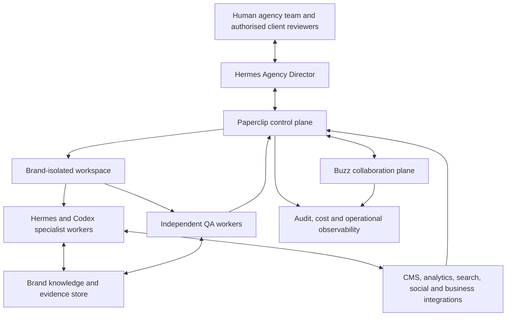

# AI Agent Digital Marketing Agency
## VM Ecosystem Implementation Blueprint

**Document status:** Build specification
**Prepared for:** The Codex agent assembling the client VM ecosystem
**Prepared on:** 24 July 2026
**Architecture assumption:** Hermes + Codex + Paperclip + Buzz
**Primary business user:** A media agency representing multiple end-client brands
**Products:** Search Authority Core and Search Authority + Social Amplifier

---

## 1. Purpose

This document is the authoritative implementation blueprint for creating a multi-brand, AI-agent-powered Digital Marketing Agency on a dedicated client VM.

It is the complete build specification. It defines:

- the business products;
- the system boundaries;
- the role of each platform;
- the agent and human roles;
- the exact workflow stages and gates;
- the information passed between stages;
- the multi-client isolation model;
- the integrations and permissions;
- the SEO, AEO, editorial and measurement standards;
- the failure and revision behaviour;
- the rollout sequence; and
- the acceptance tests that must pass before the system is considered complete.

The implementation agent must treat this blueprint and the referenced role
library as the complete target specification.

## 2. Business requirement

The media agency requires an AI-agent-powered Digital Marketing Agency that can
serve many different client types while maximising the advertising and growth
potential of each client brand.

The system must provide a complete operating lifecycle covering:

- client and brand intake;
- research and content strategy;
- canonical content and creative production;
- coordinated copywriting, SEO and AEO;
- independent editorial and technical quality review;
- risk-based human approval;
- publishing and distribution;
- analytics, monitoring and optimisation; and
- controlled learning that improves future strategy.

The agency offers two commercial products:

1. **Search Authority Core** — the complete search/content workflow without
   social amplification.
2. **Search Authority + Social Amplifier** — the upgraded product with
   channel-native social adaptation, approval, distribution and measurement.

Copywriting remains a distinct production responsibility. SEO and AEO operate
as one coordinated Search and Answer Optimisation capability so they cannot
produce conflicting versions of the same asset.

### 2.1 Client Brief ingestion

The system must accept a Client Brief through upload, form entry or approved
integration and convert it into the structured contracts in this blueprint.

| Incoming Client Brief field | Structured destination |
|---|---|
| Client Name / Brand Name | Brand Profile |
| Website | Brand Profile domains and CMS connection |
| Business/Niche | Brand Profile market and business description |
| Products/Services | Brand Profile product and offer catalogue |
| Target Country / City | Brand Profile markets and Campaign Brief geography |
| Target Audience | Brand Profile audience library plus Campaign Brief audience |
| Date to be Published | Campaign Brief deadline and publication window |
| Brand Guidelines | Brand Profile voice, visual and compliance rules |
| Topic / Guidelines on Topic | Content Brief topic, angle and constraints |
| Required Anchor Text | Content Brief link requirement, subject to QA |
| Required URL for Client Backlink | Content Brief requested external link, subject to editorial and search-policy QA |
| Identified URL for Internal Links | Content Brief internal-link targets |
| Target Performance over 3 / 12 months | Success metrics with defined baselines and observation windows |
| Content drafted by a Human Editor | `draft_origin: human\|agent\|hybrid` plus provenance |

An imported request is not automatically an approved instruction. For example, backlink and anchor-text requests must still pass editorial, disclosure and search-policy checks.

## 3. Executive design decision

Build **one reusable marketing production system with an optional Social Amplifier branch**.

Do not build two separate workflows. The upgraded product must activate additional stages through configuration:

```yaml
product:
  search_authority_core: true
  social_amplifier: false  # true for the upgraded product
```

The system must operate at two levels:

1. **Agency level:** portfolio oversight, shared standards, shared workflow templates, resource allocation and agency reporting.
2. **Brand level:** isolated knowledge, campaigns, tasks, conversations, credentials, analytics, approvals and deliverables for each end-client brand.

The top-level operational brain is the **Hermes Agency Director**. Paperclip controls and records work. Buzz provides live collaboration. Hermes and Codex workers execute specialist tasks.

## 4. Non-negotiable architecture decisions

The implementation must follow these decisions:

1. **Hermes is the executive orchestrator.** It interprets objectives, selects workflows, commissions work, handles exceptions and keeps durable client context.
2. **Paperclip is the workflow control plane.** It owns task state, dependencies, deadlines, budgets, assignments, approvals, retries and completion history.
3. **Buzz is the live collaboration plane.** It is used for focused agent-to-agent and human-agent discussion. It does not replace Paperclip or the durable knowledge store.
4. **Codex is primarily the technical specialist.** It handles code, CMS integration, schema implementation, site audits, analytics pipelines, landing pages, automation and other technical work.
5. **One Google Document must not become the system database.** Google Docs may present a client-friendly brief or final output, but operational state belongs in Paperclip and structured storage.
6. **Copywriting remains distinct from search optimisation.**
7. **SEO and AEO become one coordinated Search and Answer Optimisation capability.** They may use separate skills internally, but they must not create conflicting versions of an asset.
8. **The core asset is approved before social amplification begins.**
9. **Quality review must be independent of content production.** An agent must not approve its own work.
10. **Human approval is risk-based and configurable.** External publishing must never occur without the approval required by that brand's policy.
11. **Every factual metric must have a source and retrieval date.** Models must not invent search volume, CPC, rankings, traffic or conversion figures.
12. **Every end-client brand is a separate tenant.** Cross-brand context, credentials and raw data sharing are denied by default.
13. **A completed agent run is not automatically a completed business task.** Required artifacts, QA verdicts, approvals and publication receipts must all be checked.
14. **Optimisation must use controlled hypotheses.** Do not change copy, creative, metadata, timing and audience simultaneously without explicitly declaring a multi-variable test.
15. **The system sells business outcomes, not agent count.** Agents and skills are internal implementation details.

## 5. Product definition

### 5.1 Product A: Search Authority Core

The base product creates, publishes and improves high-quality content designed to increase qualified organic discovery and business results.

Included capabilities:

- brand and business onboarding;
- website and content baseline;
- market, audience, competitor and search research;
- keyword, entity, topic and intent analysis;
- content opportunity scoring;
- content calendar and asset briefs;
- core asset copywriting;
- SEO and answer-search optimisation;
- relevant structured data recommendations or implementation;
- internal linking recommendations;
- independent claims, source, brand and editorial QA;
- approval workflow;
- CMS publishing or publication-ready handoff;
- technical publication validation;
- Search Console and analytics measurement;
- performance reporting;
- controlled refresh and optimisation proposals.

### 5.2 Product B: Search Authority + Social Amplifier

The upgraded product includes everything in Product A and adds:

- selection of approved core assets for amplification;
- platform and audience selection;
- channel-specific copy variants;
- hook and creative variants;
- visual briefs or assets;
- channel-specific calls to action;
- social QA;
- bundled or per-channel approval;
- scheduling and distribution;
- social performance collection;
- social-to-site and assisted-conversion analysis;
- feedback into future content and campaign strategy.

### 5.3 Product boundary

The following are not automatically included unless separately configured:

- paid media buying;
- paid social campaign management;
- email marketing;
- CRM automation;
- influencer outreach;
- public relations outreach;
- reputation management;
- multilingual localisation;
- video production;
- legal advice;
- regulated-industry compliance approval;
- autonomous budget changes;
- autonomous public responses to customers.

The architecture must allow these to be added later as modules without changing the core workflow.

## 6. Conceptual system architecture



### 6.1 Authority hierarchy

1. The authorised human client or agency owner has final business authority.
2. The Hermes Agency Director has operational authority within configured limits.
3. Paperclip enforces the approved workflow and records state.
4. Specialist agents execute bounded assignments.
5. QA agents may reject work but may not approve external publication unless the brand policy explicitly grants that authority.
6. Buzz participants collaborate but may not silently change task state or approval records.

### 6.2 Source-of-truth matrix

| Information | Authoritative system |
|---|---|
| Client objective and approved brand rules | Brand Knowledge Store |
| Workflow status and task ownership | Paperclip |
| Approval decision | Paperclip approval record |
| Live collaboration | Buzz |
| Final work artifacts | Versioned artifact store linked from Paperclip |
| Credentials | Approved secret vault only |
| Search performance | Search Console and connected analytics source |
| Website publication state | CMS plus publication receipt |
| Social publication state | Connected platform or scheduler plus receipt |
| Durable agency operating standards | Hermes knowledge/vault |
| Code and configuration | Git repository |

No system may silently maintain a conflicting copy of authoritative state.

## 7. Multi-brand tenancy and isolation

### 7.1 Default model

The VM belongs to the media agency. Each of the agency's end-client brands is a separate logical tenant called a **Brand Workspace**.

Every Brand Workspace must have a unique immutable `brand_id`.

Examples:

```text
agency
├── brand_acme
├── brand_northstar
└── brand_summit
```

### 7.2 Required isolation boundaries

Each brand must have separate:

- Paperclip project space and task hierarchy;
- Buzz community or clearly isolated private-channel namespace;
- Hermes memory and knowledge namespace;
- brand profile;
- approved-facts register;
- source and evidence library;
- campaign and artifact storage;
- analytics connections;
- CMS credentials;
- social credentials;
- approval matrix;
- model and financial budgets;
- logs and audit queries;
- data-retention policy.

### 7.3 Cross-brand rules

- A worker assigned to Brand A must not receive Brand B context.
- Search indexes and retrieval filters must always include `brand_id`.
- Tool credentials must be resolved from `brand_id`; they must never be global defaults.
- Buzz participants must be explicitly admitted to a brand community or private channel.
- Paperclip task creation must require `brand_id`.
- Every artifact and event must include `brand_id`.
- Cross-brand reports may use aggregated or anonymised figures only.
- Raw copy, customer data, campaign performance, strategic findings and credentials must not cross brand boundaries.
- Any cross-brand template promoted to the shared agency library must be reviewed and stripped of client-specific data first.

### 7.4 Dedicated-VM promotion

The design must allow a Brand Workspace to move to its own VM if required by:

- contractual isolation;
- sensitive or regulated data;
- unusually high workload;
- custom network access;
- dedicated availability requirements;
- client-controlled infrastructure.

This move must not require redesigning the workflow or artifact schemas.

## 8. Agent and human role catalogue

These are logical roles. They do not all need to be permanently running processes. Most should wake for a bounded Paperclip assignment and stop when the required artifact is delivered.

### 8.1 Hermes Agency Director

**Level:** Agency
**Type:** Long-lived executive orchestrator

Responsibilities:

- interpret agency or client requests;
- confirm brand and product selection;
- check whether the brief is complete;
- create or select the Paperclip workflow;
- allocate work within time, model and cost budgets;
- select the minimum necessary specialists;
- open a Buzz collaboration room only when live discussion adds value;
- monitor exceptions, rejections and stalled work;
- request human decisions when authority is missing;
- ensure the final deliverable meets the business objective;
- close the campaign cleanly.

The Agency Director must not:

- write and approve the same asset;
- bypass required human publication approval;
- share brand data across tenants;
- treat a plausible agent response as verified evidence;
- permit unbounded agent discussion.

### 8.2 Brand and Brief Steward

**Level:** Brand/campaign
**Type:** On-demand

Responsibilities:

- turn raw client input into a structured Brand Profile or Campaign Brief;
- identify missing information;
- distinguish facts, assumptions and requested claims;
- record the offer, audience, funnel stage, intended action and success measures;
- apply the brand approval matrix;
- preserve the submitted client request without silently rewriting it.

Output:

- validated `brand_profile`;
- validated `campaign_brief`;
- `brief_readiness` verdict;
- list of unresolved questions or assumptions.

### 8.3 Search and Content Strategist

**Level:** Campaign/asset portfolio
**Type:** On-demand, high-reasoning

Responsibilities:

- combine business priorities, audience needs, existing performance and search opportunity;
- analyse search intent, customer language, entities, topics and competitors;
- identify content gaps and internal-link opportunities;
- score opportunities by relevance, business value, evidence strength, effort and likely impact;
- design the content cluster and calendar;
- create one structured brief per asset;
- avoid publishing many near-duplicate pages for minor query variations.

Output:

- `research_pack`;
- `opportunity_register`;
- `content_plan`;
- `content_brief` for each commissioned asset.

### 8.4 Content Producer

**Level:** Asset
**Type:** On-demand

Responsibilities:

- produce the canonical core asset from the approved brief;
- apply brand voice, format, audience level and funnel stage;
- use approved facts and evidence;
- add a clear and appropriate call to action;
- identify unsupported claims rather than inventing support;
- preserve source references in the internal artifact.

Output:

- `canonical_draft`;
- `claim_register`;
- `source_register`;
- declared uncertainties;
- recommended visual brief when required.

### 8.5 Search and Answer Optimiser

**Level:** Asset
**Type:** On-demand specialist

Responsibilities:

- improve the approved draft for search discovery and answer usefulness without making it robotic;
- align title, headings and content with genuine user intent;
- improve internal linking;
- create metadata;
- strengthen entity clarity and direct, useful answers;
- recommend or generate only relevant structured data;
- ensure structured data matches visible content;
- perform technical eligibility checks where site access exists;
- preserve the meaning, voice and evidence of the canonical draft.

Output:

- `optimised_asset`;
- `metadata_package`;
- `internal_link_plan`;
- `structured_data_package` where relevant;
- `search_answer_checklist`.

This role must not promise rankings, AI citations, snippets or rich results.

### 8.6 Visual and Creative Specialist

**Level:** Asset
**Type:** Conditional, on-demand

Responsibilities:

- create a visual brief or asset set from the approved content strategy;
- follow brand rules and channel requirements;
- record asset rights, source or generation provenance;
- create accessible alt text;
- avoid introducing visual claims not supported by the content.

This role may work in parallel with drafting after the content brief is stable. Final visuals must still pass QA.

### 8.7 Editorial Integrity QA

**Level:** Asset
**Type:** Independent on-demand reviewer

Responsibilities:

- verify compliance with the brief;
- check every material claim against the claim and source registers;
- check originality and useful information gain;
- check brand voice, grammar, tone and audience suitability;
- check advertiser/editorial separation where relevant;
- check prohibited claims, legal disclaimers and regulated-topic requirements;
- check SEO/AEO work for helpfulness rather than keyword stuffing;
- check metadata, links, structured data and CTA consistency;
- return a structured PASS, REVISE or BLOCK verdict.

This role must not edit the work silently and then approve its own changes. Material changes return to the responsible producer.

### 8.8 Social Amplifier

**Level:** Asset/channel
**Type:** Upgrade-only, on-demand

Responsibilities:

- start only from an approved canonical asset;
- select suitable channels and explain why;
- create platform-native versions rather than simple truncations;
- create hook, copy, CTA and creative variants;
- preserve facts and brand meaning;
- attach each social asset to its canonical source;
- propose scheduling based on available audience evidence;
- define the purpose and measurement of each post.

Output:

- `social_amplification_plan`;
- `social_asset_package`;
- `social_schedule`;
- `social_measurement_plan`.

### 8.9 Publishing Operator

**Level:** Asset/channel
**Type:** Permission-restricted execution role

Responsibilities:

- verify a valid approval record;
- create a preview or dry run where supported;
- publish or schedule exactly the approved version;
- apply metadata, canonical URL, links, tracking and structured data;
- verify the published result;
- record platform IDs, URLs, timestamps and checksums;
- fail closed if the approved artifact and proposed publication differ.

Output:

- `publication_receipt`;
- `post_publish_validation`;
- failure evidence if publication does not complete.

### 8.10 Growth Intelligence Analyst

**Level:** Asset/campaign/brand
**Type:** Scheduled, on-demand

Responsibilities:

- collect performance data from authoritative sources;
- compare results with baseline, target and observation window;
- diagnose where the funnel is failing;
- separate discovery, indexing, ranking, click-through, engagement and conversion problems;
- produce a controlled optimisation proposal;
- report uncertainty and data limitations;
- feed useful findings into the next strategy cycle.

Output:

- `performance_snapshot`;
- `performance_report`;
- `optimisation_proposal`;
- `learning_record`.

### 8.11 Human roles

The system must support at least:

- **Agency Editor:** reviews quality and coordinates the client relationship.
- **Brand Approver:** approves brand-sensitive external material.
- **Compliance/Legal Approver:** optional, required for configured topics.
- **Publishing Approver:** optional separate authority for external publication.
- **Agency Administrator:** manages brand setup, users and integrations.

One person may hold several roles, but the approval record must state which authority they exercised.

## 9. Model and worker routing

Do not hardcode all roles to one model.

Use capability classes:

| Work class | Preferred capability |
|---|---|
| Extraction, formatting, tagging | Fast, economical model |
| Research synthesis and planning | Strong reasoning model with tool access |
| Brand-sensitive copywriting | Strong language model with full brand context |
| Claims and integrity QA | Independent strong reasoning model |
| Code, CMS and analytics integration | Codex coding worker |
| Deterministic validation | Code or rules, not an LLM |

Requirements:

- Record model/provider/version for every artifact-producing run.
- Configure per-brand and per-campaign cost limits.
- Cache reusable research when freshness permits.
- Do not pay multiple agents to rediscover the same evidence.
- Use deterministic validators before spending a strong model on QA.
- Keep writer and final QA independent when practical.
- Set maximum retries and revision loops.

## 10. Workflow 0: Brand onboarding

No production campaign may begin until onboarding reaches `brand_ready`.

### 10.1 Required inputs

- legal and trading name;
- brand name;
- website and owned domains;
- products and services;
- markets, countries and cities;
- target audiences;
- commercial objectives;
- primary conversions;
- value proposition;
- differentiators;
- competitors;
- brand voice;
- visual guidelines;
- approved claims;
- prohibited claims;
- required disclaimers;
- regulated-topic flags;
- source and evidence library;
- existing content;
- CMS details;
- analytics properties;
- Search Console properties;
- social accounts;
- approval owners;
- publishing permissions;
- data-retention rules;
- product subscription;
- monthly budget and expected throughput.

### 10.2 Onboarding actions

1. Create immutable `brand_id`.
2. Create the Brand Workspace and storage namespaces.
3. Create Paperclip brand project and templates.
4. Create Buzz brand community or private-channel boundary.
5. Create the Hermes brand knowledge namespace.
6. Store credentials in the approved vault; never in documents or prompts.
7. Import and classify approved brand materials.
8. Build the Approved Facts Register.
9. Build the Prohibited Claims and Compliance Register.
10. Connect data sources with least-privilege access.
11. Run cross-tenant isolation tests.
12. Produce a human-readable Brand Operating Profile.
13. Obtain brand-owner sign-off.

### 10.3 Onboarding completion criteria

`brand_ready = true` only when:

- required fields validate;
- permissions are tested;
- approval owners are named;
- cross-brand access tests fail as expected;
- the approved-facts register exists;
- the publishing policy is explicit;
- the agency owner approves activation.

## 11. Workflow 1: Search Authority Core

### 11.1 State machine

```text
requested
  -> intake
  -> brief_ready
  -> research
  -> strategy_ready
  -> drafting
  -> search_optimisation
  -> qa_review
       -> revision_required -> drafting/search_optimisation -> qa_review
       -> blocked -> human_decision
       -> qa_passed
  -> approval_required
       -> changes_requested -> revision_required
       -> approved
  -> publish_ready
  -> publishing
  -> published
  -> validation
  -> measurement_scheduled
  -> measured
  -> optimisation_decision
       -> no_change
       -> refresh_workflow
       -> new_asset_workflow
  -> closed
```

### 11.2 Stage contract

| Stage | Owner | Required input | Required output | Gate |
|---|---|---|---|---|
| Intake | Brand and Brief Steward | Raw request, Brand Profile | Campaign Brief | Brief completeness |
| Research | Search and Content Strategist | Campaign Brief, live sources | Research Pack | Source and freshness validation |
| Strategy | Search and Content Strategist | Research Pack | Content Plan and asset briefs | Business relevance |
| Drafting | Content Producer | Approved asset brief | Canonical Draft, claims and sources | Required fields |
| Search optimisation | Search and Answer Optimiser | Canonical Draft | Optimised Asset and packages | Technical/content checklist |
| QA | Editorial Integrity QA | Complete asset package | QA Verdict | PASS required |
| Human approval | Authorised reviewer | QA-passed package | Approval Record | Required authority |
| Publishing | Publishing Operator | Approved checksum/version | Publication Receipt | Exact-version verification |
| Validation | Publishing Operator | Live URL/platform ID | Validation Report | Critical checks pass |
| Measurement | Growth Intelligence Analyst | Baseline, target, live data | Performance Snapshot | Data quality |
| Optimisation | Growth Intelligence Analyst | Performance evidence | Optimisation Proposal | Hypothesis quality |

### 11.3 Parallel work

Permitted:

- technical site baseline and audience research;
- competitor research and existing-content inventory;
- visual concept work and copy drafting after the asset brief is stable;
- deterministic link/schema validation and editorial pre-checks.

Not permitted:

- SEO/AEO rewriting before a canonical draft exists;
- social repurposing before the canonical asset is approved;
- final QA before all required asset components exist;
- publishing while approval is unresolved;
- analytics conclusions before the measurement window and minimum data threshold.

## 12. Workflow 2: Social Amplifier

The Social Amplifier is a branch from an approved canonical asset, not an independent content factory.

### 12.1 State machine

```text
canonical_asset_approved
  -> amplification_selection
  -> channel_plan
  -> social_asset_creation
  -> social_qa
       -> revision_required -> social_asset_creation
       -> qa_passed
  -> social_approval
  -> scheduling
  -> published
  -> channel_validation
  -> social_measurement
  -> cross_channel_learning
  -> closed
```

### 12.2 Social package requirements

Every social item must include:

- `brand_id`;
- `campaign_id`;
- `canonical_asset_id`;
- platform;
- audience;
- purpose;
- hook;
- body copy;
- CTA;
- link and tracking parameters;
- visual reference;
- alt text where supported;
- planned publication time;
- approval version;
- success measure;
- expiry or review date where relevant.

### 12.3 Channel rules

- Do not create content for every platform by default.
- Use only platforms approved for the brand.
- Explain the expected role of each platform.
- A channel-specific version must feel native to that channel.
- Do not add facts or promises absent from the canonical asset.
- Do not assume a “best time to post” without actual audience data.
- Bundle approvals where the brand permits it to reduce human bottlenecks.
- Each published post must return its platform ID and URL.

## 13. Research and search standards

### 13.1 Required research sources

Use the best available combination of:

- client first-party information;
- Search Console;
- web analytics;
- Google Ads Keyword Planner or approved SEO platform;
- current search results;
- competitor sites;
- existing content inventory;
- customer questions and sales/support data;
- Google Business Profile where relevant;
- authoritative industry sources.

### 13.2 Data rules

- Every metric needs `source`, `retrieved_at`, `geography`, `date_range` and `confidence`.
- Search volume and CPC must come from a connected data source.
- Keyword difficulty from third-party tools must be labelled with its provider and methodology limitations.
- “Estimated by model” is not an acceptable source for factual marketing metrics.
- Current search results must include access date.
- Research artifacts must distinguish observation, inference and recommendation.

### 13.3 Opportunity-led keyword and topic research

Use an opportunity-led method rather than arbitrary quotas of short-tail and
long-tail keywords:

1. Identify the client's real business outcomes.
2. Map audience problems and decision stages.
3. Inspect current site authority and content.
4. Gather query, topic and entity evidence.
5. Group opportunities by intent and customer journey.
6. Remove duplicates and low-relevance variations.
7. Score remaining opportunities.
8. Commission only assets with a clear purpose and evidence.

The system may still report:

- informational;
- commercial investigation;
- transactional;
- navigational;
- local;
- question-based;
- problem-solution;
- comparison;
- beginner;
- advanced.

However, categories are analysis aids, not quotas.

Do not use “LSI keywords” as an operating concept. Use related entities, subtopics, synonyms, customer language and naturally co-occurring concepts.

### 13.4 Opportunity score

Use a transparent score such as:

```text
opportunity_score =
  business_value
  + audience_relevance
  + evidence_strength
  + achievable_visibility
  + conversion_alignment
  + content_reuse_value
  - production_effort
  - compliance_risk
```

Each component should use a documented scale. The score supports human judgment; it does not replace it.

## 14. Copywriting standard

The Content Producer must receive more than a keyword list.

Every content brief must include:

- objective;
- target audience;
- audience awareness level;
- funnel stage;
- search or discovery intent;
- core problem;
- value proposition;
- unique brand evidence;
- approved claims;
- prohibited claims;
- required sources;
- desired action;
- CTA;
- format;
- approximate depth, not an arbitrary word count;
- brand voice;
- examples and anti-examples;
- internal links;
- required legal or commercial disclosure;
- approval owner.

The draft must:

- answer a genuine audience need;
- add original value, evidence, experience or analysis;
- avoid generic filler;
- avoid unsupported superlatives;
- clearly separate editorial and advertising where applicable;
- make the desired next step clear;
- keep internal source notes out of public copy.

## 15. Search and Answer Optimisation standard

SEO and AEO are implemented as one coordinated quality layer.

Required checks:

- crawl and indexing eligibility where access permits;
- search intent alignment;
- descriptive title and headings;
- natural use of important concepts;
- clear answer passages where useful;
- strong entity and relationship clarity;
- original evidence or first-party experience;
- source transparency;
- internal linking;
- sensible external citations;
- useful metadata;
- image and video support where relevant;
- page experience considerations;
- canonical URL and duplication controls;
- structured data only where valid and relevant;
- visible content matches structured data;
- no schema stuffing;
- no guaranteed ranking or citation language.

The system must not create separate thin pages for every wording variation merely to target AI or search systems.

## 16. Canonical data contracts

All artifacts must be machine-readable and human-readable. Codex should implement formal JSON Schemas for these contracts.

### 16.1 Common envelope

```yaml
schema_version: "1.0"
artifact_type: "content_brief"
artifact_id: "art_..."
brand_id: "brand_..."
campaign_id: "camp_..."
asset_id: "asset_..."
paperclip_issue_id: "..."
created_at: "ISO-8601"
created_by:
  actor_type: "human|agent|system"
  actor_id: "..."
model:
  provider: "..."
  model: "..."
  version: "..."
source_artifact_ids: []
status: "draft|review|approved|rejected|superseded"
content_checksum: "sha256:..."
```

### 16.2 Brand Profile

```yaml
brand_id: "brand_..."
legal_name: ""
brand_name: ""
website_domains: []
markets: []
products_services: []
audiences: []
value_proposition: ""
differentiators: []
brand_voice:
  traits: []
  required_phrases: []
  prohibited_phrases: []
approved_claims: []
prohibited_claims: []
required_disclosures: []
regulated_topics: []
primary_conversions: []
approval_matrix: {}
integration_refs: {}
retention_policy: {}
```

### 16.3 Campaign Brief

```yaml
campaign_id: "camp_..."
brand_id: "brand_..."
request: ""
business_objective: ""
product_tier: "search_core|search_social"
audience: []
market: []
funnel_stage: ""
offer: ""
requested_topic: ""
topic_guidance: []
required_anchor_text: null
requested_backlink_url: null
preferred_internal_link_urls: []
draft_origin: "human|agent|hybrid"
desired_action: ""
deliverables: []
channels: []
deadline: ""
budget:
  currency: ""
  amount: 0
success_metrics: []
constraints: []
assumptions: []
source_materials: []
approval_owner_ids: []
```

### 16.4 Research Pack

Required fields:

- research question;
- source register;
- retrieval dates;
- audience findings;
- market findings;
- competitor findings;
- existing-content findings;
- search and intent findings;
- entity and topic map;
- keyword data with provider attribution;
- evidence limitations;
- opportunities;
- rejected opportunities and reasons.

### 16.5 Content Brief

Required fields:

- asset objective;
- audience and funnel stage;
- primary intent;
- canonical topic;
- unique angle;
- required information gain;
- approved claims and evidence;
- prohibited claims;
- structure;
- format;
- CTA;
- brand voice;
- internal links;
- metadata direction;
- visual direction;
- success measures;
- approval requirements.

### 16.6 Asset Package

Required components:

- canonical public-facing body;
- title options;
- metadata;
- internal-link plan;
- claim register;
- source register;
- visual references;
- structured data where relevant;
- CTA;
- change log;
- public/private section boundary.

The public body must be explicitly delimited so internal notes cannot be published accidentally.

### 16.7 QA Verdict

```yaml
verdict: "PASS|REVISE|BLOCK"
reviewed_artifact_id: "..."
reviewed_checksum: "sha256:..."
criteria_version: "..."
findings:
  - severity: "critical|major|minor|suggestion"
    category: "brief|claim|source|brand|editorial|seo|aeo|technical|compliance"
    location: ""
    finding: ""
    required_action: ""
blocking_reasons: []
reviewer_id: ""
reviewed_at: ""
```

### 16.8 Approval Record

```yaml
decision: "APPROVED|CHANGES_REQUESTED|REJECTED"
artifact_id: "..."
artifact_checksum: "sha256:..."
approval_scope: "content|channel_pack|publication"
approver_id: ""
authority_role: ""
conditions: []
decided_at: ""
expires_at: null
```

Approval attaches to an exact checksum. Any material content change invalidates it.

### 16.9 Publication Receipt

Required fields:

- approved artifact ID and checksum;
- destination;
- external platform ID;
- live URL;
- publication timestamp;
- publisher identity;
- idempotency key;
- metadata applied;
- tracking parameters;
- validation results;
- screenshots or evidence references where supported;
- rollback or unpublish reference where supported.

### 16.10 Performance Snapshot

Required fields:

- baseline period;
- observation period;
- authoritative data sources;
- data freshness;
- impressions;
- clicks;
- CTR;
- qualified visits;
- conversions;
- conversion rate;
- revenue or value where available;
- social measures where applicable;
- target comparison;
- attribution limitations;
- diagnosis.

### 16.11 Optimisation Proposal

```yaml
problem_statement: ""
evidence: []
hypothesis: ""
proposed_change: ""
variables_changed: []
control_or_baseline: ""
success_metric: ""
success_threshold: ""
observation_window: ""
risks: []
rollback_plan: ""
approval_required: true
```

## 17. Paperclip implementation

### 17.1 Paperclip's role

Paperclip owns:

- campaign and asset task hierarchy;
- assignments;
- dependencies;
- status;
- budgets;
- deadlines;
- retries;
- QA and approval gates;
- artifact links;
- completion evidence;
- operational audit history.

### 17.2 Recommended hierarchy

```text
Agency portfolio
└── Brand project
    └── Campaign parent issue
        ├── Intake and brief
        ├── Research pack
        ├── Content strategy
        ├── Asset 1
        │   ├── Draft
        │   ├── Search and answer optimisation
        │   ├── Integrity QA
        │   ├── Revision N when required
        │   ├── Human approval
        │   ├── Publishing
        │   └── Measurement
        ├── Asset 2
        └── Social Amplifier branch when enabled
```

### 17.3 Paperclip rules

- Every issue must contain `brand_id`, `campaign_id` and acceptance criteria.
- A downstream issue must not start until its declared dependencies are satisfied.
- A QA rejection must create or activate a revision task against the rejected artifact.
- The next QA must review the revised artifact, not the rejected one.
- A `done` status alone is insufficient. Required artifacts and verdicts must exist.
- Completion checks must inspect both documents and substantive comments.
- Failed and cancelled history must remain auditable; do not hard-delete it as routine cleanup.
- Parent status must reflect unresolved child work.
- The workflow must detect stale locks and stalled runs.
- External publication is a distinct permissioned task.
- Every final campaign must have a closure summary and no unresolved active work.

### 17.4 Required task templates

Codex must create reusable templates for:

1. Brand onboarding.
2. Campaign intake.
3. Search and market research.
4. Content strategy.
5. Canonical asset drafting.
6. Search and answer optimisation.
7. Visual creation.
8. Editorial integrity QA.
9. Revision.
10. Human approval.
11. CMS publishing.
12. Social amplification.
13. Social approval.
14. Social publishing.
15. Performance measurement.
16. Optimisation experiment.
17. Campaign closeout.

## 18. Buzz implementation

### 18.1 Buzz's role

Buzz provides campaign-specific live collaboration among humans and agents.

Use it when:

- a strategist needs focused input from a researcher;
- a writer needs clarification from the Brand Steward;
- QA needs a source dispute resolved;
- several specialists must agree on a campaign decision;
- a human reviewer wants to discuss requested changes;
- an incident during publication needs coordinated response.

Do not use it for routine one-way handoffs that Paperclip can manage.

### 18.2 Brand and channel structure

Preferred structure:

```text
Buzz relay owned by the agency
└── Isolated brand community
    ├── private: brand-operations
    ├── private: campaign-<campaign_id>
    ├── private: asset-<asset_id>-review
    └── private: publication-incidents
```

If the installed Buzz architecture maps one relay URL to one community, Codex should use separate community endpoints or the supported multi-community mechanism. Tenant isolation must follow the actual installed version rather than an assumed API.

### 18.3 Buzz operating rules

- Each agent has its own identity and key.
- Keys stay in the credential broker or protected runtime location.
- Membership follows least privilege.
- Default to private channels for client work.
- The opening message must contain a structured context packet and decision needed.
- Participants must use links or artifact IDs rather than pasting entire knowledge stores.
- Discussions must have a time limit or exit condition.
- Decisions must be summarised back into Paperclip.
- Paperclip remains the task-state authority.
- Closing a discussion must remove unnecessary temporary participants where supported.
- No secret, credential or unapproved personal data may be posted.

### 18.4 Buzz context packet

```yaml
brand_id: "..."
campaign_id: "..."
paperclip_issue_id: "..."
purpose: ""
decision_needed: ""
participants: []
source_artifact_ids: []
constraints: []
deadline: ""
exit_condition: ""
```

### 18.5 Buzz integration mechanism

Use the mature supported interface available in the installed Buzz version:

- `buzz-cli` JSON input/output;
- REST/WebSocket APIs;
- the supported Codex/agent harness;
- signed agent identities.

Build a small adapter rather than embedding Buzz-specific calls throughout the agency system.

The adapter must support:

- create/find brand workspace;
- create private channel;
- add/remove authorised participant;
- post context packet;
- post message or artifact reference;
- collect decision summary;
- link channel to Paperclip issue;
- archive or mark the channel complete;
- return event/audit identifiers.

## 19. Integration architecture

### 19.1 Adapter pattern

Each external service must be wrapped by a typed adapter.

Minimum adapter methods:

```text
authenticate(brand_id)
test_connection()
read_capabilities()
preview(action)
execute(action, approval_ref, idempotency_key)
verify(external_id)
rollback(external_id)  # where supported
```

### 19.2 Initial integration set

Build interfaces for:

- CMS;
- Google Search Console;
- GA4 or approved analytics platform;
- Google Ads Keyword Planner or approved SEO provider;
- social scheduler or individual social platforms;
- document export;
- approved image/DAM service;
- CRM or conversion source where available.

Not every adapter must be active for the MVP. Missing integrations must degrade to a controlled, human-executed handoff rather than invented success.

### 19.3 External-action rules

- Read operations may run within configured access.
- Draft and preview operations should be preferred before write operations.
- Publishing requires a valid approval record.
- All writes require idempotency keys.
- Retry logic must not create duplicate posts or pages.
- The exact published version must match the approved checksum.
- Credentials must not appear in prompts, logs, artifacts or Buzz.
- Integration errors must return evidence and remain visible in Paperclip.

## 20. Operator interface and user journey

The agency team needs a clear operating interface. It may be implemented as a dedicated agency console or a thin experience over Paperclip, but it must not create a second workflow-state database.

### 20.1 Required views

1. **Agency Portfolio Dashboard**
   - all authorised brands;
   - active and blocked campaigns;
   - work awaiting approval;
   - deadlines and publishing calendar;
   - budget and model usage;
   - operational and business performance summaries;
   - incidents requiring attention.

2. **Brand Workspace**
   - approved Brand Profile;
   - current campaigns;
   - content calendar;
   - approved-facts and compliance summaries;
   - connected platforms and connection health;
   - brand-level performance;
   - authorised people and agents.

3. **Onboarding Wizard**
   - new-brand selection;
   - upload or paste a Client Brief;
   - structured extraction preview;
   - missing-information questions;
   - integration setup;
   - approval-policy setup;
   - final Brand Operating Profile sign-off.

4. **Campaign Builder**
   - choose brand;
   - choose Search Authority Core or activate Social Amplifier;
   - upload or create Campaign Brief;
   - select deliverables and channels;
   - define deadline, budget and success measures;
   - preview the resulting workflow before launch.

5. **Campaign Workspace**
   - Paperclip task graph and current stage;
   - accountable owner;
   - artifacts and version history;
   - QA findings and revision history;
   - linked Buzz discussion;
   - approvals;
   - publication and measurement status.

6. **Approval Inbox**
   - exact asset preview;
   - changes since the previous version;
   - QA verdict and unresolved risks;
   - destinations and scheduled times;
   - approve, request changes or reject;
   - clear display of the checksum/version being approved.

7. **Publishing Calendar**
   - web and social schedule;
   - brand and campaign filters;
   - approval state;
   - platform status;
   - failed and retried publications;
   - pause controls for authorised operators.

8. **Performance and Learning**
   - baselines and targets;
   - business, search and social measures;
   - data freshness and source;
   - diagnostic findings;
   - proposed experiments;
   - approved learnings.

9. **Administration**
   - users and roles;
   - brands and isolation boundaries;
   - agent identities;
   - model and budget policies;
   - integration health;
   - retention and offboarding;
   - audit search.

### 20.2 User journey

1. The Editor selects an existing brand or begins controlled onboarding.
2. The Editor uploads the Client Brief.
3. The system extracts a structured draft and shows missing or uncertain fields.
4. The authorised user confirms the brief, product tier, targets, deadline and approval owners.
5. Hermes creates the Paperclip campaign and shows the proposed workflow.
6. The system displays progress through task state, not a generic “agents are working” message.
7. Each major artifact becomes reviewable as a separately versioned output.
8. QA failures show the finding, owner and revision status.
9. Approval requests show exactly what will be published, where and when.
10. Publishing returns live evidence.
11. Measurement appears according to the configured observation windows.
12. Optimisation proposals require an explicit hypothesis and decision.

### 20.3 Client access

Direct end-client access is optional and disabled by default.

Where enabled, a client may see only:

- its own Brand Workspace;
- designated briefs and deliverables;
- approval requests;
- publication calendar;
- approved performance reports;
- selected private Buzz review channels.

Clients must not see internal prompts, other brands, hidden operational notes, unrestricted model traces or agency-wide financial data unless explicitly authorised.

### 20.4 Notifications

Notify the right human for:

- missing brief information;
- QA `BLOCK`;
- approval required;
- approval nearing deadline;
- publication failure;
- critical validation failure;
- broken integration;
- budget threshold;
- campaign delay;
- performance anomaly requiring a decision.

Notifications must link to the authoritative Paperclip item. They must not contain credentials or unnecessary confidential content.

## 21. Human approval policy

Approval is configurable by brand and action.

### 21.1 Default policy

Human approval is required for:

- first campaign for a new brand;
- public publication;
- material claims about health, finance, law, safety or regulated products;
- comparative or competitor claims;
- major changes to positioning;
- paid campaign activation or budget changes;
- new channels;
- crisis or reputation-sensitive content;
- any QA `BLOCK`;
- any action outside established brand rules.

### 21.2 Streamlined policy

After a brand has demonstrated stable operation, the agency may approve bounded categories in batches, for example:

- ten scheduled posts derived from one approved canonical asset;
- metadata-only updates below a risk threshold;
- internal draft generation;
- reporting and analysis.

The system must still record who granted the policy and its scope.

### 21.3 Revision policy

- Maximum normal revision loops: 3.
- After 3 failed QA rounds, escalate to the Agency Editor.
- A `critical` finding blocks publication.
- A `major` finding requires revision unless an authorised human records an exception.
- Minor findings may be accepted by an authorised editor.
- The producer must respond to every required QA action.

## 22. Publication validation

Publishing is not complete until validation passes.

For web assets, validate where applicable:

- HTTP success;
- correct canonical URL;
- indexability directives;
- title and meta description;
- headings and public body;
- internal and external links;
- structured data syntax and visible-content match;
- images and alt text;
- analytics and conversion tags;
- mobile rendering;
- approved CTA;
- absence of internal notes;
- approved checksum equivalence.

For social assets, validate:

- correct account;
- correct text and creative;
- correct link and tracking parameters;
- correct scheduled or live time;
- platform ID;
- visibility;
- absence of truncation or formatting failure.

Critical validation failure must create an incident task and stop any remaining scheduled distribution when safe to do so.

## 23. Measurement and optimisation

### 23.1 Measurement hierarchy

Use measures in this order:

1. **Business outcome:** leads, sales, qualified enquiries, revenue or other defined conversion.
2. **Conversion quality:** conversion rate, lead quality, assisted conversion.
3. **Qualified traffic:** relevant visits and engaged sessions.
4. **Search discovery:** impressions, clicks, CTR, query coverage and branded/non-branded growth.
5. **Social distribution:** reach, engagement, shares, referral visits and assisted conversions.
6. **Operational efficiency:** time to publish, revision count, cost per approved asset and approval delay.

Page views alone are not a sufficient success measure.

### 23.2 Observation windows

Do not apply one fixed 30/60/90-day rule to every asset.

Configure windows by asset and channel:

- immediate: publication and tracking validation;
- early: indexing, delivery and obvious distribution problems;
- intermediate: impressions, clicks and engagement;
- mature: conversions, authority and business results;
- long-term: decay, refresh and cluster performance.

The asset brief must define its expected windows.

### 23.3 Diagnostic order

Before recommending changes, diagnose:

1. Was the asset published correctly?
2. Can the platform/search engine access it?
3. Has it been indexed or distributed?
4. Is it receiving impressions/reach?
5. Is the title/hook earning clicks or engagement?
6. Does the content satisfy visitors?
7. Does the CTA convert?
8. Is the audience or offer wrong?

Do not rewrite content when the real problem is tracking, indexing, distribution or the offer.

### 23.4 Learning loop

Every agent participates in the learning loop. Before its work, each specialist
must read the applicable Learning Context Manifest, retrieve only active,
validated and correctly scoped role-specific learning, apply validated
corrections and check for known failed patterns. During and after work,
specialists create Failure Observations and Candidate Learnings with exact
evidence. They may not activate, promote, retire or share durable guidance
themselves.

The Hermes Agency Director owns learning governance across the ecosystem. The
Growth Intelligence Analyst supplies measurement evidence, other specialists
propose lessons and Paperclip stores the authoritative record and links. The
Agency Director decides the final brand-only, agency-shared or discard
disposition, subject to configured human approval and independent evidence.

Before planning new work, the Agency Director must query active validated
learning for the exact brand, workflow, task class, channel/integration and
known failure signature. It must attach a Learning Context Manifest to the
applicable Paperclip task or campaign identifying the records consulted and how
they changed or constrained the plan.

Every optimisation cycle must produce a small durable Learning Record:

- what was expected;
- what happened;
- what was changed;
- what result followed;
- how confident the system is;
- the evidence supporting the conclusion;
- the workflow and failure signatures to which it applies;
- its freshness, review date and supersession lineage;
- whether the learning may influence future strategy.

Failures, QA rejections, avoidable rework, policy denials and unexpected
outcomes must also produce a typed Failure Observation. Before retrying, the
Agency Director must check the proposed action against validated failure
patterns. A known failed approach may not be repeated unchanged unless new
evidence and an explicit authorised exception are recorded.

Only reviewed, evidence-supported and brand-safe learnings may be promoted into
shared agency playbooks. Brand-only records remain tenant-scoped; hypotheses do
not become rules; contradicted, stale or inapplicable records are superseded or
retired with their audit lineage preserved. If the learning store or its tenant
scope cannot be verified, the workflow must degrade visibly rather than invent
memory.

## 24. Security, privacy and audit requirements

- Use least-privilege credentials.
- Store secrets only in the approved credential vault.
- Redact secrets and sensitive personal information from logs.
- Require `brand_id` on every retrieval and write.
- Enforce tenant filters in code, not only prompts.
- Test that Brand A cannot search or retrieve Brand B.
- Use separate agent identities and auditable actions.
- Keep approval records immutable.
- Retain content provenance.
- Log model, tool, actor and artifact IDs.
- Configure retention and deletion per brand contract.
- Back up operational databases and artifact storage.
- Do not expose Paperclip, Buzz administration or internal APIs publicly without approved access controls.
- Default Buzz client work to private channels.
- Treat uploaded client material as confidential.
- Do not use client content to train shared models unless explicitly authorised.
- Provide a brand offboarding and data-export process.

## 25. Cost, concurrency and efficiency controls

The system must avoid creating an expensive room full of agents for every task.

Required controls:

- per-brand monthly budget;
- per-campaign budget;
- per-asset budget;
- model class routing;
- maximum concurrent workers;
- maximum retries;
- maximum revision loops;
- research cache with freshness rules;
- duplicate-work detection;
- agent wake-on-task rather than permanent polling where possible;
- Buzz room creation only when collaboration adds value;
- timeouts and stalled-run detection;
- asset batching where it does not reduce quality;
- cost and latency reporting.

Paperclip should stop or escalate work approaching its budget rather than silently downgrade quality.

## 26. Events and traceability

Use a common event envelope:

```yaml
event_id: "evt_..."
event_type: "asset.qa_passed"
occurred_at: "ISO-8601"
brand_id: "brand_..."
campaign_id: "camp_..."
asset_id: "asset_..."
paperclip_issue_id: "..."
actor_id: "..."
artifact_id: "..."
artifact_checksum: "sha256:..."
correlation_id: "trace_..."
idempotency_key: "..."
```

Minimum events:

- `brand.created`;
- `brand.ready`;
- `campaign.requested`;
- `brief.ready`;
- `research.completed`;
- `strategy.approved`;
- `asset.draft_ready`;
- `asset.optimised`;
- `asset.qa_failed`;
- `asset.qa_passed`;
- `asset.approval_requested`;
- `asset.approved`;
- `publication.requested`;
- `publication.completed`;
- `publication.validation_failed`;
- `measurement.due`;
- `measurement.completed`;
- `optimisation.proposed`;
- `social.package_ready`;
- `social.approved`;
- `social.published`;
- `campaign.closed`.

Every task, Buzz room, artifact, approval and external action must be linkable through the correlation ID.

## 27. Suggested logical repository structure

Codex should adapt paths to the existing deployment conventions, but preserve these boundaries:

```text
agency-os/
├── README.md
├── docs/
│   ├── architecture/
│   ├── runbooks/
│   └── operator-guides/
├── config/
│   ├── products/
│   ├── workflows/
│   ├── qa-policies/
│   └── schemas/
├── agents/
│   ├── agency-director/
│   ├── brief-steward/
│   ├── strategist/
│   ├── content-producer/
│   ├── search-answer-optimiser/
│   ├── integrity-qa/
│   ├── social-amplifier/
│   ├── publishing-operator/
│   └── growth-intelligence/
├── adapters/
│   ├── paperclip/
│   ├── buzz/
│   ├── cms/
│   ├── search-console/
│   ├── analytics/
│   ├── keyword-data/
│   └── social/
├── workflows/
│   ├── brand-onboarding/
│   ├── search-core/
│   ├── social-amplifier/
│   └── optimisation/
├── validators/
├── tests/
│   ├── unit/
│   ├── integration/
│   ├── end-to-end/
│   ├── tenant-isolation/
│   └── publication-safety/
└── examples/
    ├── fictional-brand/
    └── sample-campaign/
```

Runtime client data and credentials must not be committed to this repository.

## 28. Build sequence

### Phase 0: Verify the host ecosystem

Codex must first:

- inspect the installed Hermes, Paperclip, Buzz and Codex versions;
- inspect supported APIs and authentication;
- map this logical design to the actual deployment;
- identify existing reusable skills, adapters and workflow patterns;
- document any material mismatch before changing the architecture.

### Phase 1: Foundation

Build:

- core IDs and common event envelope;
- JSON Schemas;
- artifact store;
- Brand Workspace isolation;
- credential references;
- Paperclip adapter and templates;
- Buzz adapter;
- audit and tracing;
- fictional test brand.

### Phase 2: Search Authority Core MVP

Build one complete vertical slice:

- onboarding;
- intake;
- research;
- strategy;
- drafting;
- search and answer optimisation;
- independent QA;
- human approval;
- publication preview or sandbox;
- validation;
- measurement setup.

Do not begin with many content types. Prove one web article or landing-page workflow end to end.

### Phase 3: Social Amplifier

Add:

- activation flag;
- channel plan;
- platform-native variants;
- social QA;
- bundled approval;
- scheduler/platform adapter;
- channel validation;
- cross-channel measurement.

### Phase 4: Multi-brand operation

Add and prove:

- at least two fictional brands;
- tenant-isolated retrieval;
- tenant-isolated Buzz and Paperclip work;
- separate credentials;
- portfolio-level reporting;
- workload and budget controls.

### Phase 5: Production integrations and optimisation

Connect approved real services, add content types, improve reporting and introduce controlled automation only after the preceding gates pass.

## 29. Acceptance tests

### 29.1 Architecture

- Hermes Agency Director can create the correct workflow from a valid brief.
- Paperclip accurately shows the state and dependencies.
- Buzz discussions link back to the correct issue.
- Codex technical work returns a versioned artifact.
- No component competes with another as the task-state authority.

### 29.2 Product selection

- `social_amplifier: false` completes without creating social tasks.
- `social_amplifier: true` creates the social branch only after canonical approval.
- Both products use the same core workflow and schemas.

### 29.3 Tenant isolation

- A Brand A retrieval cannot return Brand B material.
- A Brand A worker cannot use Brand B credentials.
- A Brand A Buzz member cannot enter Brand B private channels.
- Portfolio reporting contains no raw cross-brand content.

### 29.4 Data quality

- Search metrics without a source and retrieval date fail validation.
- Invented model estimates cannot populate factual metric fields.
- Every material draft claim maps to evidence or an explicit uncertainty.

### 29.5 QA and revision

- The producer cannot approve its own artifact.
- A failed QA creates a revision path.
- The next QA reviews the revised checksum.
- Three failed normal revisions escalate to a human.
- Internal notes do not appear in the extracted public body.

### 29.6 Approval and publishing

- Publishing without valid approval fails closed.
- Approval for checksum A cannot publish changed checksum B.
- Retrying a publish call does not create a duplicate.
- Publication does not complete until validation passes.
- A failed validation creates visible incident work.

### 29.7 Social

- Social assets cannot start from an unapproved core asset.
- Every post links to its canonical asset.
- Social copy cannot introduce an unsupported claim.
- The correct brand account and platform are verified.

### 29.8 Measurement

- Measurement uses the configured baseline and window.
- The analyst distinguishes technical, discovery, CTR and conversion problems.
- Optimisation proposals name the hypothesis and variable changed.
- No claim of success is made when the data is below the minimum threshold.

### 29.9 Recovery and operations

- Stalled workers and stale locks are detected.
- Failed integrations return actionable evidence.
- Backup and restore are tested.
- Brand offboarding can export and remove the tenant according to policy.

### 29.10 Operator interface

- An Editor can import a Client Brief and confirm the structured result.
- Product selection visibly changes the workflow before launch.
- The campaign view reflects Paperclip state without maintaining a conflicting status.
- The Approval Inbox shows the exact version and destination.
- The Publishing Calendar exposes failures and authorised pause controls.
- A client-scoped user cannot see another brand or agency-only information.
- Every notification links back to an authoritative task or approval.

## 30. Definition of done

The implementation is complete only when:

1. A fictional brand can be onboarded.
2. The base product runs end to end.
3. The Social Amplifier can be activated without duplicating the core workflow.
4. Independent QA can reject, trigger revision and later pass an asset.
5. Approval binds to an exact version.
6. A sandbox or approved test destination can publish and validate an asset.
7. Performance collection and an optimisation proposal work with sourced data.
8. Two fictional brands pass all isolation tests.
9. Every important action is traceable across Hermes, Paperclip, Buzz and artifacts.
10. Operator documentation explains normal operation, failure recovery, onboarding and offboarding.
11. No real client credential or confidential information is committed to source control.
12. The required operator views support the complete user journey.
13. The authorised owner signs off the completed acceptance-test report.

## 31. Configuration decisions that remain client-specific

These items should be configuration, not hardcoded assumptions:

- initial number of brands;
- expected monthly campaign and asset volume;
- CMS platforms;
- analytics platform;
- keyword/SEO data provider;
- social platforms;
- social scheduling tool;
- CRM and conversion source;
- document export format;
- image and design tooling;
- approval owners;
- regulated-topic policies;
- retention periods;
- target service levels;
- model budgets;
- whether clients receive direct Buzz access;
- whether publication is automatic after approval or always manually initiated.

Codex can build the framework without these final selections. It must use safe placeholders and mocked adapters rather than inventing credentials or enabling external publication.

## 32. Implementation-agent instructions

The Codex builder must:

- treat this document as the target design;
- verify live platform capabilities before choosing exact APIs;
- prefer existing Hermes and Paperclip patterns where they satisfy this specification;
- avoid creating unnecessary permanent agents;
- keep the workflow data-driven and schema-validated;
- create tests alongside each capability;
- use fictional data until real-client use is separately authorised;
- keep all external writes approval-gated;
- report any material architectural conflict rather than silently improvising;
- deliver code, configuration, schemas, tests, migration instructions, runbooks and an acceptance-test report.

The builder must not:

- turn every workflow function into a separate always-running agent;
- combine the client brief, work state and analytics into one Google Document;
- let Buzz replace Paperclip;
- let Paperclip replace Hermes's executive role;
- allow agents to cross brand boundaries;
- invent marketing metrics;
- auto-publish unapproved work;
- treat “agent completed” as equivalent to “business task completed”;
- duplicate the core workflow for the upgraded product.

## 33. External guidance informing this blueprint

Current official guidance should be rechecked during implementation:

- Google: AI features use normal SEO foundations and do not require special AI schema:
  <https://developers.google.com/search/docs/appearance/ai-features>
- Google: create helpful, reliable, people-first content:
  <https://developers.google.com/search/docs/fundamentals/creating-helpful-content>
- Google: structured data must follow content and quality rules and does not guarantee a rich result:
  <https://developers.google.com/search/docs/appearance/structured-data/sd-policies>
- Google: third-party SEO and AEO tools cannot guarantee performance:
  <https://developers.google.com/search/docs/fundamentals/third-party-seo>
- Google Ads: Keyword Planner provides sourced estimates for search and advertising planning:
  <https://support.google.com/google-ads/answer/7337243>
- Buzz: official project and architecture:
  <https://github.com/block/buzz>
- Buzz: communities, channels, agent identities and relay model:
  <https://block.github.io/buzz/support.html>

---

## Final build principle

Build a disciplined marketing production system, not a collection of agents talking to one another.

The value comes from:

- correct client context;
- specialist work in the right order;
- reliable evidence;
- independent quality control;
- safe publication;
- measurable business outcomes;
- reusable workflows;
- strict brand isolation; and
- continuous learning from real results.

Hermes directs the business objective. Paperclip controls the work. Buzz enables focused collaboration. Hermes and Codex specialists produce and validate the output. Humans retain the authority that matters.
