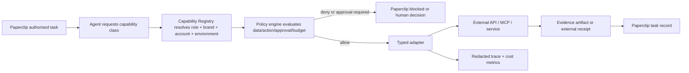

# Capability Registry and Action Gateway Specification

**Status:** Build requirement
**Applies to:** All 12 agency roles and every API, MCP, SDK, browser, model,
database, design, analytics and publishing integration
**Authority:** Paperclip remains the business workflow and approval authority

## Purpose

The Capability Registry answers one question before an agent can use a tool:

> Is this exact role allowed to perform this exact action for this exact brand,
> account, environment, data class and artifact state?

Tool discovery, an available credential, an MCP tool description, a Buzz
message or a prior successful call is never an acceptable answer.

The registry is provider-neutral. Provider names, API versions, endpoints and
credentials are runtime bindings. Role contracts request capability classes
such as `web_research.read`, `analytics_report.read`,
`creative_asset.generate` or `destination.publish`.

## Non-negotiable architecture



- Paperclip owns task, approval, budget and closure state.
- The registry resolves admitted capabilities.
- The policy engine makes deterministic decisions.
- The adapter enforces schemas, identity, timeout and idempotency.
- The agent cannot bypass this path.
- Buzz carries discussion only.

## Capability classes

Use provider-neutral verbs:

| Class | Meaning | Typical authority |
|---|---|---|
| `*.observe` | Inspect local/runtime state without client content mutation | read |
| `*.read` | Read bounded client or provider data | read |
| `*.research` | Retrieve untrusted external sources | read/open-world |
| `*.draft` | Create an internal draft in an approved system | internal write |
| `*.generate` | Create a new media/content artifact through a provider | external compute/write |
| `*.upload` | Store an asset externally without publication | external write |
| `*.schedule` | Create a future external action | external write |
| `*.publish` | Make content publicly visible | public write |
| `*.pause` | Stop a scheduled/live action where supported | external write |
| `*.rollback` | Revert or unpublish where supported | destructive/recovery |
| `*.configure` | Change account, connector, webhook, scope or policy | privileged |
| `*.spend` | Commit or alter advertising/commercial spend | financial |

The registry must not collapse `read`, `draft`, `schedule` and `publish` into a
single “connected” flag.

## Default role capability posture

These are ceilings for initial build policy, not automatic grants. A live
registry entry, tenant binding and task authority are still required.

| Role | Normal capabilities | Default-denied capabilities |
|---|---|---|
| Agency Director | Paperclip orchestration, approved capability/policy read, bounded Buzz collaboration | publication, infrastructure, credentials, provider configuration and spend |
| Technical Implementation Specialist | repository/code/schema work, sandbox tests, adapter construction | unapproved production deployment, real-client publication, provider/account administration |
| Platform Assurance Reviewer | candidate/evidence read, sandbox adversarial tests, gate verdict | build mutation, self-remediation, publication and business approval |
| Brand and Brief Steward | approved intake/source reads, internal brand/brief artifact writes | strategy, public claims promotion without authority, publication |
| Search and Content Strategist | research and first-party measurement reads, strategy artifact writes | content publication, persistent monitors, account/property changes |
| Content Producer | approved evidence/brand reads, internal draft writes | broad autonomous research, fact promotion, QA and publication |
| Search and Answer Optimiser | technical/search property reads, internal package writes | CMS/search-property mutation, URL submission, QA and publication |
| Visual and Creative Specialist | scoped design read; approved generation/edit/upload under creative manifest | broad library/DAM access, approval and publication |
| Editorial Integrity QA | candidate/source/rendering reads, exact-checksum QA verdict | candidate modification, approval and publication |
| Social Amplifier | channel-capability/owned-metrics read, internal social-package writes | engagement, DMs, replies, listening/scraping, paid media, publication |
| Publishing Operator | exact-manifest preview, draft, schedule, publish, lookup and rollback only where approved | strategy/content creation, account/configuration, audience, consent, CRM and spend |
| Growth Intelligence Analyst | brand-scoped analytics/CRM aggregate read, analysis artifact writes | admin/configuration, conversion import, audience export, CRM write, publication and spend |

## Minimum registry record

```yaml
capability:
  capability_id: "cap_..."
  capability_class: "analytics_report.read"
  status: "active | degraded | suspended | expired | pilot"
  provider:
    name: "runtime binding"
    interface: "rest | graphql | mcp_http | mcp_stdio | sdk | internal"
    endpoint_ref: "non-secret configuration reference"
    api_or_protocol_version: "runtime value"
    adapter_version: "immutable build/version"
    admitted_identity_or_digest: "server/app/image identity"
  scope:
    brand_id: "brand_..."
    allowed_role_ids: []
    environment: "development | staging | production"
    account_or_property_refs: []
    allowed_resource_patterns: []
    allowed_destinations: []
    allowed_verbs: []
    prohibited_verbs: []
  data_policy:
    input_classes: ["public | internal | confidential | restricted"]
    output_classes: []
    tenant_boundary: "single_brand"
    provider_retention: "documented setting/reference"
    provider_training_use: "disabled | contractually_excluded | unknown"
    allowed_regions: []
    max_payload_bytes: 0
    content_in_telemetry: false
  authority:
    action_class: "read | internal_write | external_write | public_write | privileged | financial"
    human_approval_rule_ref: "policy reference or none"
    approval_must_bind:
      - "brand_id"
      - "artifact_or_manifest_checksum"
      - "destination"
      - "operation"
      - "schedule_window"
    policy_bundle_ref: "immutable policy version"
  credentials:
    broker_binding_ref: "secret reference, never value"
    oauth_scopes: []
    audience: "expected resource"
    expiry_and_rotation_ref: "operational reference"
  reliability:
    timeout_ms: 0
    rate_limit_profile_ref: "runtime reference"
    cost_unit_and_ceiling_ref: "budget reference"
    idempotency: "native | adapter_ledger | unsupported"
    lookup_and_reconciliation: "supported | partial | unsupported"
    retry_policy_ref: "bounded policy"
    fallback_capability_ids: []
    fallback_requires_human: true
  evidence:
    input_schema_ref: "versioned JSON Schema"
    output_schema_ref: "versioned JSON Schema"
    evidence_artifact_type: "SourceObservation | TechnicalEvidenceRecord | receipt | ..."
    trace_policy_ref: "redaction/sampling policy"
  lifecycle:
    owner: "named platform role/human"
    admitted_by: "approval record"
    admitted_at: "ISO-8601"
    last_verified_at: "ISO-8601"
    revalidate_by: "ISO-8601"
    deprecation_or_sunset_at: null
    disable_and_recovery_runbook_ref: "..."
```

## MCP admission profile

For every MCP server, additionally record:

- server publisher and ownership;
- exact transport and endpoint;
- authenticated server identity or local artifact digest;
- discovered tool/resource/prompt inventory checksum;
- admitted tool names only;
- input/output schemas and maximum result size;
- declared annotations, while treating them as untrusted claims;
- requested OAuth scopes and token audience;
- permitted egress domains;
- server-initiated sampling, elicitation, Roots and Tasks are disabled by default;
- each enabled feature has a separately admitted capability, policy rule, maximum
  payload/cost/time budget and cancellation behavior;
- sampling requires an explicit approved consent path, a reviewed prompt/result
  disclosure policy and a gateway-bound provider/data scope; the server may not
  choose an undisclosed prompt, provider, destination or retention setting;
- Roots require an explicit allowlisted URI/mount set; server requests may not
  broaden filesystem, repository, tenant or network scope;
- elicitation may request only the pre-approved fields, never credentials,
  payment data or secrets; a request for authority becomes a Paperclip human
  decision rather than an automatic response;
- Tasks are non-authoritative integration work only and require bounded
  lifecycle, polling/cancellation, result-schema and failure-handoff rules;
- prompt-injection and tool-poisoning test result;
- supply-chain provenance/SBOM/signature evidence where applicable;
- supply-chain verification receipt containing subject image/binary digest,
  trusted issuer/identity, provenance builder/source reference, SBOM digest,
  verification policy version, verification time and revocation/expiry result;
- kill/disable procedure.

Any material schema, description, endpoint, identity, scope or tool inventory
change suspends the capability until re-admitted. MCP form elicitation must not
collect credentials, payment data or other secrets.

## External agent/A2A profile

A2A may be used only through an admitted adapter for an external or
independently operated agent. Its Agent Card is untrusted discovery data.

The admitted A2A record must include the peer endpoint, protocol/interface
version, verified TLS/server identity, Agent Card and authenticated-extended-card
digest where used, admitted security scheme, allowed skill IDs, allowed message
and artifact schemas, maximum payload/result size, timeout/rate limits, task and
context ID mapping, egress allowlist and disable/recovery procedure.

The adapter must:

- authenticate and authorize every peer request over approved production
  transport; derive peer identity from that authentication, not from Agent Card
  fields;
- treat public and authenticated Agent Cards as untrusted discovery input until
  their admitted digest, endpoint, identity, interface and skills match the
  registry;
- suspend the capability on material card, skill, endpoint, schema, identity or
  security-scheme drift;
- bind every outbound task, context and artifact update to local `brand_id`,
  Paperclip issue and correlation ID;
- validate every received message/artifact against admitted schemas and record
  it as untrusted integration evidence;
- map `input-required` or `auth-required` responses to a Paperclip human
  decision; never forward credentials, tokens or secret-bearing authentication
  material supplied by the peer;
- prevent the peer from approving, closing or directly mutating Paperclip; and
- enforce the same data, policy, trace, expiry, retention and fallback rules as
  any other provider.

## Action Gateway request

Every external, public, privileged or financial action, and every internal
control-plane mutation explicitly designated by the capability registry, must
pass through the action gateway. Ordinary Paperclip task-state transitions use
the Paperclip adapter and its own transition policy; they do not require a
publication approval or artifact checksum unless their registered action class
requires one.

The gateway derives workload identity from the authenticated runtime. It must
not trust an agent-supplied principal, tenant, approval, budget or destination
assertion. The registry schema declares which fields are required for each
action class.

```yaml
action_request:
  request_id: "..."
  request_binding_checksum: "sha256:canonical-action-request"
  correlation_id: "..."
  actor_principal_id: "derived by gateway from authenticated workload"
  actor_role_id: "..."
  brand_id: "..."
  campaign_id: "required when campaign-scoped; otherwise null"
  paperclip_issue_id: "..."
  capability_id: "..."
  operation: "..."
  action_class: "read | internal_write | external_write | public_write | privileged | financial"
  environment: "..."
  destination_ref: "required for destination actions; otherwise null"
  artifact_or_manifest_id: "required when capability policy requires it; otherwise null"
  artifact_or_manifest_checksum: "required when capability policy requires it; otherwise null"
  schedule_window: "required for schedule/publication actions; otherwise null"
  approval_record_id: "required only when current policy requires human approval; otherwise null"
  approval_expiry: "required when approval_record_id is present; otherwise null"
  idempotency_key: "required for externally observable or retryable writes; otherwise null"
  budget_state_ref: "..."
  requested_at: "ISO-8601"
```

Immediately before dispatch, the gateway must atomically re-read trusted
capability, approval, revocation, tenant, destination and budget state; bind the
result to `request_binding_checksum`; and issue a one-time dispatch nonce. A
stale, revoked, expired, changed or previously consumed decision fails closed.

## Policy decision receipt

```yaml
policy_decision:
  decision_id: "..."
  request_id: "..."
  request_binding_checksum: "sha256:canonical-action-request"
  dispatch_nonce: "single-use value"
  policy_bundle_ref: "immutable version"
  outcome: "allow | deny | human_approval_required"
  reason_codes: []
  evaluated_bindings:
    actor_principal_id: "..."
    role_id: "..."
    brand_id: "..."
    campaign_id: "..."
    paperclip_issue_id: "..."
    capability_id: "..."
    operation: "..."
    action_class: "..."
    environment: "..."
    destination_ref: "..."
    artifact_checksum: "..."
    schedule_window: "..."
    approval_record_id: "..."
    approval_expiry: "..."
    budget_state_ref: "..."
  decided_at: "ISO-8601"
  valid_until: "ISO-8601"
```

An `allow` result never replaces a human approval required by brand policy.
The adapter may dispatch only with a current, unconsumed receipt whose binding
checksum and evaluated bindings exactly match the request.

## Read and research evidence response

Read capabilities return an evidence artifact rather than invisible prompt
context:

```yaml
source_observation:
  source_observation_id: "srcobs_..."
  brand_id: "..."
  capability_id: "..."
  source_ref: "URL | file_ref | approved_system_record"
  publisher_or_owner: "..."
  source_type: "first_party_measurement | platform_measurement | retrieved_page | client_evidence | model_inference | recommendation"
  query_or_request_ref: "redacted request artifact"
  retrieved_at: "ISO-8601"
  published_at: null
  updated_at: null
  freshness_basis: "live | dated | static | unknown"
  stale_after: null
  usage_scope: "public | internal | restricted | prohibited"
  licence_and_attribution: []
  snapshot_or_response_checksum: "sha256:..."
  limitations: []
  supports_claim_ids: []
  supports_entity_ids: []
```

Tool/model answers, summaries and snippets are not promoted to authoritative
source status. They may point to an underlying source observation.

## Publication state and reconciliation

The canonical state machine is:

```text
NOT_STARTED
  -> REQUESTED
  -> ACCEPTED | PROCESSING | SCHEDULED | PUBLISHED | FAILED | UNKNOWN
```

- `ACCEPTED`, `PROCESSING` and `SCHEDULED` are not publication proof.
- Timeout, lost response, malformed response, partial batch result or
  destination/webhook disagreement becomes `UNKNOWN`.
- The adapter persists the idempotency key before an external call.
- An `UNKNOWN` or partial result must be looked up and reconciled before retry.
- Inbound webhooks require signature/authentication, timestamp/replay and event
  deduplication checks.
- Rendered web/social output must be read through an independent path and
  compared with the approved manifest.

## Telemetry schema

Ordinary traces may contain:

- `brand_id`, campaign and Paperclip issue ID;
- role and capability ID;
- adapter/policy version;
- artifact or manifest checksum;
- policy decision ID;
- external receipt ID;
- status, latency, token/cost units and error class.

Ordinary traces must not contain:

- prompts or model responses;
- client documents or public-body content;
- raw tool arguments/results;
- personal or restricted identifiers;
- credentials, tokens or secret-bearing URLs/headers.

Telemetry storage, queries, exports and dashboards must enforce the same
brand-scoped access control and retention policy as the operational artifact
store. Ordinary trace metadata may not be used to browse, correlate or export
another brand's campaigns, destinations, receipts, timings or cost data.
Diagnostic capture requires a separate tenant-scoped policy, encryption/access
control, expiry and deletion evidence. Cross-brand reliability reporting must
use approved aggregates that cannot reveal an individual brand's activity.

Use OpenTelemetry-compatible trace propagation, but keep an internal stable
schema so experimental GenAI semantic fields cannot become a safety dependency.

## Lifecycle

1. **Propose:** named business need, role, brand/data/action classes and expected
   measurable benefit.
2. **Assess:** security, privacy, rights, account eligibility, scopes, quotas,
   cost, retention and failure semantics.
3. **Pilot:** fictional/synthetic data and sandbox destination first.
4. **Admit:** independent evidence, human approval and registry entry.
5. **Operate:** health, cost, denial, error, drift and deprecation monitoring.
6. **Revalidate:** scheduled and event-driven checks.
7. **Suspend:** immediately on identity/schema/scope drift, suspected leakage,
   expired approval or unsafe provider change.
8. **Retire:** revoke credentials, disable egress, reconcile pending writes,
   retain required evidence and remove the binding.

New persistent MCP servers, agents, monitors, webhooks, providers, credentials
or automation remain explicit approval-gated platform changes.

## Required acceptance tests

- allowed role/brand/read path succeeds;
- nearest denied role, brand, account and write path fails;
- registry absence or expiry fails closed;
- changed MCP schema/description/identity suspends the capability;
- hidden prompt injection cannot alter the request envelope;
- OAuth token audience and scope are enforced;
- policy/approval replay across brand/checksum/destination fails;
- timeout and partial external writes reconcile without duplicate action;
- destination webhook replay is rejected;
- degraded capability produces a visible Paperclip handoff;
- trace content redaction holds on allowed and failed calls;
- direct egress cannot bypass the adapter or credential broker;
- rate, time, payload and cost ceilings are enforced.

## Role ownership

| Concern | Accountable | Builds/operates | Independently verifies |
|---|---|---|---|
| Business need and workflow selection | Agency Director | Technical adapter | Platform Assurance |
| Capability registry/schema | Agency Director for need | Technical Implementation | Platform Assurance |
| Policy/action gateway | Agency Director for policy intent | Technical Implementation | Platform Assurance |
| Runtime identity, egress and secrets | Human VM owner | Human VM owner | Platform Assurance |
| Provider adapter | Assigned business owner for requirements | Technical Implementation | Platform Assurance |
| Evidence use | Relevant specialist | Relevant specialist | Editorial QA where content-related |
| External publication | Human approval policy | Publishing Operator via adapter | QA before action; Assurance for platform |
| Metrics interpretation | Growth Intelligence | Read adapters by Technical | Relevant human owner/Assurance |

No builder, specialist, connector or provider self-approves admission,
publication, privileged access or its own independent gate.
