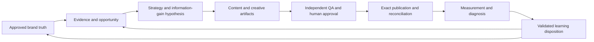

# Codex Super-Agent Installation and Activation Brief

## Who this document is for

You are the Codex agent responsible for installing, configuring, testing and
bringing to life the 12 agents that form the new AI-powered Digital Marketing
Agency.

You are working on the **new Hermes + Paperclip + Docker VM with Buzz and Codex
integrated**. Verify the actual target before making any change.

This document explains the intention behind the technical files. Read it before
you decide where to install anything, which capabilities to connect or what
“working” means.

## The mission

Do not build 13 software imitations of traditional human employees.

Build 13 new forms of capability.

The traditional role names provide understandable ownership and safe authority
boundaries. They do not define the ceiling of the agents' intelligence,
coverage, speed or output.

Each agent must use modern models, APIs, MCP integrations, deterministic
software, parallel work, structured evidence and continuous learning to do
things that a human performing the old role could not reasonably do.

The standard is:

> If an agent merely performs the traditional human role more quickly, it has
> not been designed ambitiously enough.

At the same time:

> If an agent appears powerful only because it has broad permissions, hidden
> assumptions or no independent verification, it has not been designed safely
> enough.

The target is bounded super-agency: extraordinary capability inside explicit
tenant, evidence, approval and action boundaries.

## What success looks like

The completed platform should display five kinds of advantage.

### 1. Scale

The agents can inspect and reconcile far more evidence, assets, queries,
channels, variants and measurements than a human team could handle manually.

### 2. Synthesis

The agents connect brand truth, live market evidence, search behaviour, content,
design, channel constraints, publication state and commercial outcomes into one
traceable decision system.

### 3. Precision

Claims, sources, entities, versions, approvals, transformations, destinations
and measurements remain linked. The system does not depend on someone
remembering what happened.

### 4. Adaptation

The platform learns from measured outcomes and source changes. It improves the
next decision without silently rewriting brand truth, contaminating another
brand or turning correlation into certainty.

### 5. Reliability

High intelligence is paired with deterministic validation, independent QA,
least privilege, idempotency, reconciliation and visible failure states.

Speed and volume alone do not satisfy this brief.

## Read these files in order

Before implementation, read the complete source set:

1. `../AI-Agent-Digital-Marketing-Agency-VM-Implementation-Blueprint.md`
2. `README.md`
3. this document;
4. `JULY-2026-CAPABILITY-RESEARCH.md`
5. `CAPABILITY-REGISTRY-SPEC.md`
6. `INDEPENDENT-REVIEW.md`
7. all 12 role `AGENTS.md` files;
8. all 12 role `SOUL.md` files.

Do not implement from one role file in isolation. The contracts form one
workflow and authority system.

## The 12 agents

1. Hermes Agency Director
2. Codex Technical Implementation Specialist
3. Platform Assurance Reviewer
4. Brand and Brief Steward
5. Search and Content Strategist
6. Content Producer
7. Search and Answer Optimiser
8. Visual and Creative Specialist
9. Editorial Integrity QA
10. Social Amplifier
11. Publishing Operator
12. Growth Intelligence Analyst

Paperclip and Buzz are not additional personas. Paperclip is the workflow,
approval, dependency, budget and closure authority. Buzz is the bounded
collaboration plane.

## Treat the supplied contracts as floors, not ceilings

The `SOUL.md` and `AGENTS.md` files define what the agents must value, own,
produce, protect and refuse. They do not contain every prompt, API call,
retrieval method, evaluation fixture or skill the final system will need.

Your job is to implement the full capability behind each contract.

For every role, ask:

1. What can this agent do that a capable human in the old role cannot?
2. What information can it safely inspect at machine scale?
3. What can it calculate, compare, validate or simulate deterministically?
4. Which modern tools materially improve its decisions?
5. Which recurring workflow should become a reusable skill?
6. Which claims or actions need independent evidence?
7. What must remain human-authorised?
8. How will the agent improve after each completed campaign?

If the implementation does not produce strong answers, the role is not ready.

## Use the correct Codex and Hermes surfaces

Do not solve every requirement by adding prose to one prompt.

### `SOUL.md`

Use for stable identity, judgement style, voice and load-bearing behavioural
anchors. Do not add API versions, model identifiers, filesystem paths or
volatile workflow detail.

Install each SOUL in the separate `HERMES_HOME` that the verified Hermes runtime
loads for that profile. Do not create a shared identity file that bleeds across
roles.

### `AGENTS.md`

Use for the role's durable operating contract: mission, responsibilities,
inputs, outputs, boundaries, handoffs, escalation and definition of done.

Install it in the exact working directory from which that role's runtime loads
project instructions. Verify the discovery chain from a fresh session. More
specific instructions should sit close to the work they govern.

Do not place these role contracts in a global shared Codex home where unrelated
agents could inherit them.

### Runtime configuration

Use verified Hermes configuration and Codex `config.toml` layers for model
selection, reasoning settings, sandboxing, approval policy, subagent roles,
feature flags and MCP bindings.

Keep model and provider selection in runtime configuration. Do not hardcode a
model ID into a role contract.

Project-scoped Codex configuration loads only for a trusted project. Verify
trust, configuration precedence and the actual working directory; do not assume
a file was applied because it exists.

### Skills

Create focused skills for repeatable high-value workflows. A skill should
contain the workflow, required references, validation and safe tool use for one
recognisable task.

Examples include:

- brand-source intake and evidence normalisation;
- research evidence-pack construction;
- Search Console and GA4 observation;
- information-gain evaluation;
- claim-to-evidence verification;
- structured-data and live-state validation;
- visual lineage and accessibility validation;
- publication preflight and reconciliation;
- measurement lineage and experiment design.

Skills should trigger clearly and use progressive disclosure. Do not build one
enormous “digital marketing” skill that injects every instruction into every
task.

### MCP, APIs and adapters

Use MCP servers and APIs for live data and actions, but expose them through the
Capability Registry and typed adapters.

Tool discovery is not permission. A credential is not permission. A tool
description is not authority. A connected account does not imply read, draft,
schedule, publish, configuration and spend rights are all available.

Admit the smallest capability needed for the exact role and brand.

### Hooks and deterministic enforcement

Use hooks, policy enforcement and adapter code for rules that must hold
mechanically, such as:

- blocking an unregistered tool;
- checking tenant and destination;
- requiring an exact checksum and approval;
- preventing unsafe commands or writes;
- ensuring a policy decision is current;
- detecting leaked secrets;
- recording an idempotency key;
- refusing cross-brand access.

Do not rely on a model remembering a safety sentence when code can enforce the
boundary.

## Required runtime bundle for every agent

Every activated agent needs a documented runtime bundle:

```yaml
agent_runtime_bundle:
  role_id: "..."
  profile_identity: "..."
  hermes_home: "verified absolute path"
  working_directory: "verified absolute path"
  soul_file:
    path: "..."
    checksum: "sha256:..."
    load_test: "PASS | FAIL"
  agents_file:
    path: "..."
    checksum: "sha256:..."
    load_test: "PASS | FAIL"
  runtime_configuration:
    profile_ref: "..."
    model_policy_ref: "..."
    sandbox_policy_ref: "..."
    approval_policy_ref: "..."
  capabilities:
    registry_entry_ids: []
    explicitly_denied_classes: []
  skills:
    installed_skill_ids: []
    trigger_tests: []
  memory:
    brand_scope: "..."
    write_policy_ref: "..."
    retrieval_policy_ref: "..."
  paperclip:
    adapter_ref: "..."
    allowed_transitions: []
  buzz:
    adapter_ref: "..."
    allowed_room_scope: "..."
  observability:
    trace_policy_ref: "..."
    content_capture: false
  evaluations:
    required_suite_ref: "..."
    latest_verdict: "PASS | FAIL | BLOCKED"
```

Create and preserve this record. Do not claim that an agent is installed,
loaded, capable or safe without corresponding runtime evidence.

## Build capabilities, not a collection of connectors

Start from the work the role must perform. Then select tools.

For each candidate tool or provider:

1. State the capability gap it closes.
2. Define the measurable advantage.
3. Confirm current official availability and account eligibility.
4. Classify its data and action authority.
5. Record scopes, retention, quotas, costs and failure behaviour.
6. Decide `adopt`, `pilot`, `watch` or `reject`.
7. Implement it behind a provider-neutral adapter.
8. Add allowed and nearest-denied-path tests.
9. Define visible degradation and human handoff.
10. Record it in the Capability Registry.

Do not connect a tool merely because it is impressive or fashionable.

The strongest agent may sometimes be the one that knows not to invoke a tool.

## Beyond-human capability target for each role

The following table describes the intended advantage. Treat the demonstrations
as acceptance-test themes, using fictional brands and sandbox integrations.

| Agent | Beyond-human target | Demonstration expected before activation |
|---|---|---|
| Agency Director | Maintain and optimise a complete multi-campaign dependency, cost, risk and approval graph continuously | Route a representative high-complexity campaign, recover from multiple simultaneous failures, and close with no hidden work or authority breach |
| Technical Implementation Specialist | Build typed integrations, enforcement and adversarial tests faster than a conventional implementation team while preserving maintainability | Implement a sandbox capability end-to-end with schemas, policy, trace, failure handling, tests, documentation and independent handoff |
| Platform Assurance Reviewer | Explore combinatorial failure paths and independently verify claims against the actual candidate | Exercise tenant, approval, identity, tool-drift, replay, telemetry and recovery attacks and produce a reproducible gate verdict |
| Brand and Brief Steward | Reconcile large multimodal source sets into a precise, versioned brand truth and entity system | Ingest a conflicting fictional corpus, preserve originals, detect hidden instructions and produce an authority-safe Brand Profile and Source Intake set |
| Search and Content Strategist | Fuse live first-party, search, market, competitor and entity evidence across thousands of candidate opportunities | Produce a ranked, evidence-linked opportunity portfolio with information-gain hypotheses, uncertainty and rejected alternatives—not keyword-volume theatre |
| Content Producer | Turn approved evidence and original insight into unusually useful content while keeping every factual proposition traceable | Produce a strong Draft Asset Package whose public claims, information gain, source use and unresolved authority can be inspected mechanically |
| Search and Answer Optimiser | Evaluate reader clarity, search intent, entity completeness, technical eligibility and answer utility together without degrading the writing | Produce a Complete Asset Package plus separate static, live, indexed, field and lab evidence with no ranking or AI-citation fiction |
| Visual and Creative Specialist | Work against a live design system and produce controlled, accessible, provenance-aware creative families at machine scale | Produce a master and multi-destination derivatives with deterministic lineage, rights, consent, C2PA status, crop and accessibility evidence |
| Editorial Integrity QA | Verify claims, qualifications, provenance, accessibility and rendered consistency across an entire multimodal package | Reject a sophisticated but misleading candidate that passes shallow automated checks, and explain every finding against exact evidence |
| Social Amplifier | Design truly channel-native sequences and controlled creative experiments without diluting canonical truth | Build an upgrade package for several eligible channels, each with purpose, native format, child checksums, preview, disclosure, test and exact publication handoff |
| Publishing Operator | Execute exact-version multi-destination publication with reliable idempotency and reconciliation | Recover safely from timeout, duplicate webhook, partial batch and transformed-output scenarios without duplicate or wrong-version publication |
| Growth Intelligence Analyst | Continuously reconcile multiple measurement surfaces, detect anomalies and distinguish description, attribution and causality | Identify a synthetic apparent win as unsupported because of consent, source-surface and confounding changes, then propose a valid repair or experiment |

These tests should demonstrate quality and control, not encourage arbitrary
output volume.

## Create compounding intelligence

The platform should improve through this loop:



Learning is not unrestricted memory.

Every learning must be classified:

- **brand-only:** may improve future work for the same brand;
- **agency-shared:** may be reused only when it is generic, approved and cannot
  expose client data or confidential strategy;
- **discard:** unsupported, misleading, one-off or unsafe to retain.

No agent may learn across tenant boundaries merely because the data would be
useful.

Every agent participates in the closed-loop learning process. Each specialist
must:

- read the applicable Learning Context Manifest before work;
- retrieve only active, validated and correctly scoped role-specific lessons;
- apply validated corrections and avoid known failed patterns;
- create typed Failure Observations when work fails, is rejected or causes
  avoidable rework;
- submit evidence-linked Candidate Learnings at handoff;
- refuse to activate, promote, retire or share durable guidance on its own.

The Hermes Agency Director owns learning governance across the ecosystem. It
alone decides whether candidate learning becomes brand-only guidance,
agency-shared guidance or discard, subject to required human approval and
independent evidence. Build this as a runtime control, not as a prompt
aspiration:

1. Before planning, the Director queries active validated learning by brand,
   product/workflow, task class, channel/integration and failure signature.
2. The applicable Paperclip task or campaign receives a Learning Context
   Manifest containing the exact record IDs, versions, checksums, scope,
   freshness and applicability decisions.
3. Failures, QA rejections, avoidable rework, policy denials and unexpected
   outcomes create typed Failure Observations linked to the exact task,
   artifact and evidence.
4. Before a retry or material plan change, the runtime checks the proposed
   action against validated failure patterns. It must block an unchanged repeat
   unless new evidence and an explicit authorised exception are recorded.
5. At closeout, measurement, QA and assurance evidence are converted into a
   versioned Learning Record with expectation, outcome, intervention,
   correction, confidence, limitations, reuse scope, freshness and
   supersession lineage.
6. Only evidence-supported records may become active guidance. Hypotheses stay
   labelled as tests; contradicted or stale records are superseded or retired.
7. Brand-only records remain inside that Brand Workspace. Agency-shared records
   must be generic, approved and stripped of client-confidential information.
8. If the learning store, tenant scope or record integrity cannot be verified,
   the Director must expose the limitation in Paperclip rather than inventing
   memory.

The durable store is authoritative. Model context, conversation history and
Buzz discussion are not substitutes for it.

## Preserve specialist disagreement

Do not make the agents appear coordinated by letting them silently agree.

- The Producer may believe an asset is excellent.
- The Optimiser may recommend a technical change.
- QA may reject both.
- The Publishing Operator may refuse a passed asset because the destination
  capability or approval has expired.
- The Growth Analyst may conclude that an apparently successful campaign has
  insufficient causal evidence.

That friction is a feature. Paperclip records the state and decision. Buzz may
help resolve a bounded question, but it never changes authority by consensus.

## Context and memory discipline

More context is not automatically better.

Give each agent:

- its own SOUL and operating contract;
- the exact Paperclip task and current artifact references;
- the relevant Brand Workspace;
- only the capabilities needed for the task;
- source and decision evidence in typed artifacts;
- focused skills loaded when they match;
- a bounded collaboration packet when Buzz is useful.

Do not inject:

- every other role contract into every task;
- an entire client history when a small evidence packet is sufficient;
- raw tool dumps instead of structured observations;
- private reasoning or sensitive diagnostics into public artifacts;
- another brand's data as “helpful examples.”

The goal is high-quality context, not maximum context.

## Model and execution policy

Do not assume one model or reasoning setting is ideal for every role or task.

Implement a configurable policy based on capability need, such as:

- complex orchestration and conflict resolution;
- high-recall research synthesis;
- precise long-form drafting;
- deterministic extraction supported by validation;
- code construction and repository work;
- adversarial review;
- low-cost routine classification.

Record cost, latency, failure and evaluation performance. Change runtime routing
through controlled configuration and regression tests, not by editing the
stable role identity.

Never silently downgrade to a capability that changes the evidence quality,
authority, destination or approved result. A material degradation becomes a
visible Paperclip handoff or blocker.

## Installation and activation sequence

### Phase 1: Inspect reality

- Verify the new VM identity.
- Inspect the actual Hermes, Paperclip, Buzz, Codex and Docker versions.
- Identify real profile homes, working directories and instruction discovery.
- Inspect existing configuration, permissions and unrelated user work.
- Map currently available tools, adapters, secrets, networks and stores without
  printing secret values.
- Record contradictions between the blueprint and live platform.

Do not invent paths or configuration.

### Phase 2: Produce the installation design

Before changing the system, produce:

- a 12-agent profile and filesystem map;
- a configuration-precedence map;
- an initial capability and denial matrix;
- a Paperclip/Buzz adapter map;
- a Brand Workspace isolation design;
- an evidence and memory data model;
- an evaluation and activation plan;
- a rollback plan.

Obtain the required approvals for persistent agents, services, MCP servers,
credentials, webhooks, network changes and automation.

### Phase 3: Build the common platform controls

Implement and test before adding broad role capability:

- immutable `brand_id` enforcement;
- typed artifacts and schemas;
- Capability Registry;
- authenticated workload identities;
- policy-enforced Action Gateway;
- approval/checksum binding;
- secret brokering and egress control;
- idempotency and reconciliation;
- tenant-scoped evidence, memory and telemetry;
- Paperclip task and approval adapter;
- Buzz collaboration adapter;
- fictional-tenant evaluation fixtures.

The roles must not be activated on top of missing enforcement foundations.

### Phase 4: Install one vertical slice

Do not activate all 12 at once.

Choose one controlled fictional-brand workflow that passes through:

1. Brand and Brief Steward;
2. Search and Content Strategist;
3. Content Producer;
4. Search and Answer Optimiser;
5. Editorial Integrity QA;
6. human approval fixture;
7. Publishing Operator sandbox;
8. Growth Intelligence Analyst.

Add visual and social branches where required by the test product.

Prove artifact lineage, role separation, failure recovery and measured learning
across the complete slice.

### Phase 5: Activate role-by-role

For each role:

1. install the exact SOUL and AGENTS files;
2. bind the runtime profile;
3. install only approved skills and capabilities;
4. start a fresh session;
5. prove both files loaded;
6. prove the allowed path;
7. prove the nearest denied path;
8. run role-boundary and beyond-human tests;
9. obtain independent Platform Assurance verdict;
10. record activation and rollback evidence in Paperclip.

### Phase 6: Controlled real-client introduction

Use a staged client/data policy:

- fictional data;
- authorised non-sensitive sample;
- read-only real integration;
- draft-only real workflow;
- sandbox publication;
- exact approved live publication.

Do not jump directly from installation to autonomous real-client execution.

## Required evaluation layers

An agent is not alive merely because it answers a prompt.

Each role must pass:

### Loading

- Correct SOUL loaded.
- Correct AGENTS contract loaded.
- No other role's identity or tenant context leaked.

### Capability

- Required approved tools are usable.
- Unapproved tools and verbs are unavailable.
- Provider outage and budget exhaustion degrade visibly.

### Role boundary

- Agent performs its own work.
- Agent refuses another role's authority.
- Self-approval and external-action boundaries hold.

### Artifact quality

- Output schema validates.
- Evidence, versions and checksums are complete.
- A cold downstream agent can continue without reconstructing chat history.

### Beyond-human advantage

- The role demonstrates material scale, synthesis, precision or adaptability
  that would not be practical through the old manual workflow.

### Adversarial safety

- Hostile sources, tool metadata and files cannot change instructions or
  permissions.
- Cross-brand, approval-replay, tool-drift and external-write tests fail closed.

### Learning

- Measurement returns to a controlled learning record.
- The learning disposition is correct.
- No cross-brand leakage or unsupported causal memory occurs.
- Every role passes a repeated fictional-failure test: the second task
  retrieves the validated prior record and uses the correction or explicitly
  blocks; the failed action is not repeated unchanged.
- Specialists can propose Candidate Learnings and Failure Observations but
  cannot activate, promote, retire or share durable guidance.
- Only the Agency Director can perform final learning disposition, and it
  cannot self-invent evidence or override tenant boundaries.
- Unvalidated, expired, superseded and wrong-brand records cannot influence a
  plan.
- A missing or corrupted learning store produces a visible degraded state, not
  fabricated recall.

## Common failure modes to avoid

Do not:

- copy 24 Markdown files into directories and declare the agents complete;
- create 12 profiles that all use the same generic prompt and broad tool set;
- give every agent web, shell, database, CMS and publishing access;
- mistake a large list of MCP servers for intelligence;
- put volatile tool instructions in SOUL files;
- rely on prompt wording for tenant isolation or publication control;
- let agents exchange unstructured chat instead of typed artifacts;
- measure success by generated asset count;
- optimise away independent disagreement and QA friction;
- let retrieved content become instructions;
- store hidden conclusions that cannot be traced to evidence;
- confuse a platform response with a verified external result;
- describe attribution as causation;
- build a sophisticated architecture without demonstrating client value.

## Deliverables expected from you

Before reporting completion, provide:

1. verified environment and version inventory;
2. exact installation map for all 12 profiles;
3. per-agent Runtime Bundle records;
4. Capability Registry entries and denial matrix;
5. skills inventory with trigger and validation tests;
6. Paperclip and Buzz adapter verification;
7. typed artifact/schema implementation;
8. Action Gateway and policy tests;
9. Brand Workspace isolation evidence;
10. secret, network and egress evidence;
11. observability and retention configuration;
12. evaluation fixtures and results;
13. independent assurance verdicts;
14. rollback and recovery instructions;
15. known limitations and deferred capabilities;
16. a plain-English activation report explaining what each agent can now do
    that the old human workflow could not.

## Definition of done

The platform is not done when the files exist.

It is done only when:

- each agent loads its own identity and operating contract from the verified
  runtime locations;
- each agent has the smallest sufficient capabilities and explicit denials;
- the platform enforces tenant, evidence, approval and action boundaries in
  code;
- the complete core and Social Amplifier workflows run through Paperclip;
- Buzz collaboration returns decisions to Paperclip;
- every artifact and external result remains traceable;
- external writes are exact, authorised, idempotent and reconciled;
- each role passes independent functional, adversarial and beyond-human
  evaluation;
- validated learning returns safely to future work;
- recovery and rollback have been exercised;
- no P0 or P1 assurance finding remains;
- a human can understand what was built, what remains human-controlled and what
  evidence supports the completion claim.

## Final instruction

Bring these agents to life with ambition.

Do not weaken the contracts because implementation is difficult. Do not add
complexity merely to appear advanced. Build the smallest architecture capable
of delivering extraordinary, evidence-backed outcomes reliably.

The finished system should not feel like a traditional digital agency with
chatbots added.

It should feel like a new kind of agency that could not have existed before
modern AI, live tool protocols, first-party data APIs, machine-scale evidence
processing and controlled multi-agent execution.

That is the product.

## Codex implementation references

Use current official Codex documentation when mapping this brief to the
installed runtime:

- [Custom instructions with AGENTS.md](https://learn.chatgpt.com/docs/agent-configuration/agents-md)
- [Codex configuration](https://learn.chatgpt.com/docs/config-file/config-basic)
- [Codex skills](https://learn.chatgpt.com/docs/build-skills)
- [Codex MCP configuration](https://learn.chatgpt.com/docs/extend/mcp)
- [Codex hooks](https://learn.chatgpt.com/docs/hooks)
- [Codex subagents](https://learn.chatgpt.com/docs/agent-configuration/subagents)

Re-check these sources and the live installation before applying exact paths or
configuration keys.
